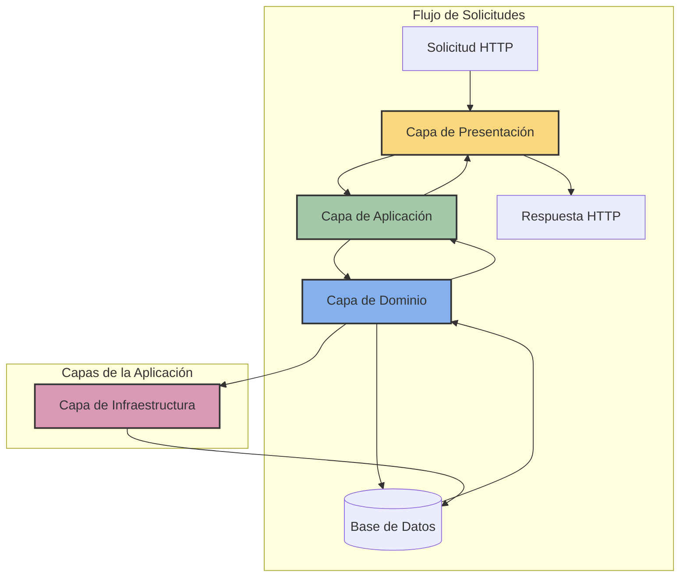
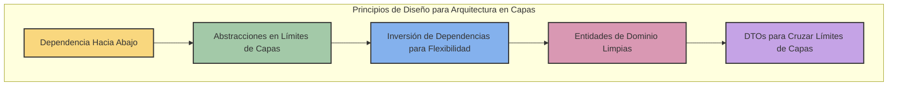

# Arquitectura en Capas

La arquitectura en capas es uno de los patrones arquitectónicos más tradicionales y ampliamente utilizados en el desarrollo de software. Este enfoque organiza el sistema en capas horizontales, donde cada capa proporciona servicios a la capa superior y utiliza los servicios de la capa inferior.

## Principios Fundamentales

La arquitectura en capas se basa en los siguientes principios:

1. **Separación de responsabilidades**: Cada capa tiene una responsabilidad específica y claramente definida.
2. **Abstracción**: Cada capa oculta sus detalles internos y expone solo interfaces bien definidas.
3. **Aislamiento**: Los cambios en una capa no deberían afectar a las capas no adyacentes.
4. **Dependencia unidireccional**: Las capas superiores dependen de las inferiores, pero no al revés.

## Diagrama de la Arquitectura en Capas



## Capas Típicas

Una aplicación típica basada en capas suele incluir las siguientes capas (de arriba hacia abajo):

### 1. Capa de Presentación (UI)

**Responsabilidad**: Interactúa con el usuario, muestra información y captura entradas.

**Componentes comunes**:
- Interfaces de usuario (web, móvil, escritorio)
- API controllers
- Vistas y plantillas
- Validación de entrada básica

```python
# Ejemplo de controlador en Flask (Capa de Presentación)
@app.route('/usuarios/<int:usuario_id>', methods=['GET'])
def obtener_usuario(usuario_id):
    try:
        # Llama a la capa de aplicación
        usuario = servicio_usuarios.obtener_por_id(usuario_id)
        if not usuario:
            return jsonify({"error": "Usuario no encontrado"}), 404
        return jsonify(usuario.to_dict())
    except Exception as e:
        return jsonify({"error": str(e)}), 500
```

### 2. Capa de Aplicación

**Responsabilidad**: Orquesta el flujo de la aplicación, coordina la lógica de negocio y controla las transacciones.

**Componentes comunes**:
- Servicios de aplicación
- Orquestadores
- Casos de uso
- DTOs (Data Transfer Objects)

```python
# Ejemplo de servicio de aplicación (Capa de Aplicación)
class ServicioUsuarios:
    def __init__(self, repositorio_usuarios):
        self.repositorio_usuarios = repositorio_usuarios
    
    def obtener_por_id(self, usuario_id):
        # Llama a la capa de dominio/repositorio
        usuario = self.repositorio_usuarios.obtener_por_id(usuario_id)
        if not usuario:
            return None
        return usuario
    
    def crear_usuario(self, datos_usuario):
        # Validaciones de aplicación
        if self.repositorio_usuarios.existe_email(datos_usuario.email):
            raise EmailDuplicadoError("El email ya está en uso")
        
        # Crea la entidad de dominio
        nuevo_usuario = Usuario(
            nombre=datos_usuario.nombre,
            email=datos_usuario.email,
            password=self.hash_password(datos_usuario.password)
        )
        
        # Persiste a través del repositorio
        return self.repositorio_usuarios.guardar(nuevo_usuario)
```

### 3. Capa de Dominio

**Responsabilidad**: Contiene la lógica de negocio, entidades y reglas del dominio de la aplicación.

**Componentes comunes**:
- Entidades
- Objetos de valor
- Servicios de dominio
- Lógica y reglas de negocio

```python
# Ejemplo de entidad de dominio (Capa de Dominio)
class Usuario:
    def __init__(self, nombre, email, password):
        self.id = None  # Asignado durante la persistencia
        self.nombre = nombre
        self.email = email
        self.password_hash = password
        self.fecha_registro = datetime.now()
        self.activo = True
    
    def cambiar_password(self, password_actual, nueva_password, verificador_password):
        if not verificador_password.verificar(self.password_hash, password_actual):
            raise PasswordIncorrectoError("La contraseña actual es incorrecta")
        
        self.password_hash = verificador_password.hashear(nueva_password)
    
    def desactivar(self):
        self.activo = False
```

### 4. Capa de Infraestructura

**Responsabilidad**: Proporciona capacidades técnicas que soportan las capas superiores, como persistencia, comunicación, etc.

**Componentes comunes**:
- Repositorios y DAOs (Data Access Objects)
- Implementaciones de interfaces de dominio
- Clientes de servicios externos
- ORM y acceso a datos
- Frameworks y librerías

```python
# Ejemplo de repositorio (Capa de Infraestructura)
class RepositorioUsuariosSQLAlchemy(RepositorioUsuarios):
    def __init__(self, session):
        self.session = session
    
    def obtener_por_id(self, usuario_id):
        return self.session.query(UsuarioModel).filter_by(id=usuario_id).first()
    
    def guardar(self, usuario):
        if usuario.id:
            # Actualizar usuario existente
            usuario_model = self.session.query(UsuarioModel).get(usuario.id)
            usuario_model.nombre = usuario.nombre
            usuario_model.email = usuario.email
            usuario_model.password_hash = usuario.password_hash
            usuario_model.activo = usuario.activo
        else:
            # Crear nuevo usuario
            usuario_model = UsuarioModel(
                nombre=usuario.nombre,
                email=usuario.email,
                password_hash=usuario.password_hash,
                fecha_registro=usuario.fecha_registro,
                activo=usuario.activo
            )
            self.session.add(usuario_model)
        
        self.session.commit()
        return usuario_model.to_entity()
```

## Estructura de Proyecto para Arquitectura en Capas

Una estructura de proyecto bien organizada es crucial para implementar efectivamente una arquitectura en capas. A continuación se muestra una estructura de proyecto recomendada para una aplicación Flask que sigue este patrón:

```
layered-flask-application/
│
├── app/                            # Código principal de la aplicación
│   ├── presentation/               # Capa de Presentación
│   │   ├── api/                    # Endpoints API
│   │   │   ├── __init__.py
│   │   │   ├── auth_routes.py
│   │   │   ├── user_routes.py
│   │   │   └── error_handlers.py
│   │   ├── web/                    # Interfaces web (si aplica)
│   │   │   ├── __init__.py
│   │   │   ├── forms.py
│   │   │   └── views.py
│   │   ├── dto/                    # Data Transfer Objects
│   │   │   ├── __init__.py
│   │   │   └── user_dto.py
│   │   └── __init__.py
│   │
│   ├── application/                # Capa de Aplicación
│   │   ├── services/               # Servicios de aplicación
│   │   │   ├── __init__.py
│   │   │   ├── user_service.py
│   │   │   └── auth_service.py
│   │   ├── use_cases/              # Casos de uso específicos
│   │   │   ├── __init__.py
│   │   │   └── user_registration.py
│   │   └── __init__.py
│   │
│   ├── domain/                     # Capa de Dominio
│   │   ├── models/                 # Entidades y objetos de valor
│   │   │   ├── __init__.py
│   │   │   ├── user.py
│   │   │   └── value_objects.py
│   │   ├── interfaces/             # Interfaces/puertos
│   │   │   ├── __init__.py
│   │   │   └── repositories.py
│   │   ├── services/               # Servicios de dominio
│   │   │   ├── __init__.py
│   │   │   └── password_service.py
│   │   ├── exceptions.py           # Excepciones de dominio
│   │   └── __init__.py
│   │
│   ├── infrastructure/             # Capa de Infraestructura
│   │   ├── persistence/            # Implementación de persistencia
│   │   │   ├── __init__.py
│   │   │   ├── database.py         # Configuración de DB
│   │   │   ├── models/             # Modelos ORM
│   │   │   │   ├── __init__.py
│   │   │   │   └── user_model.py
│   │   │   └── repositories/       # Implementaciones de repositorios
│   │   │       ├── __init__.py
│   │   │       └── user_repository.py
│   │   ├── external/               # Servicios externos
│   │   │   ├── __init__.py
│   │   │   └── email_service.py    
│   │   ├── auth/                   # Implementación de autenticación
│   │   │   ├── __init__.py
│   │   │   └── jwt_provider.py
│   │   └── __init__.py
│   │
│   ├── config/                     # Configuración
│   │   ├── __init__.py
│   │   └── settings.py
│   │
│   └── __init__.py                 # Factory de la aplicación
│
├── tests/                          # Pruebas
│   ├── unit/
│   │   ├── domain/
│   │   ├── application/
│   │   └── infrastructure/
│   ├── integration/
│   └── e2e/
│
├── migrations/                     # Migraciones de base de datos
├── requirements.txt                # Dependencias
├── .env.example                    # Ejemplo de variables de entorno
├── .gitignore
├── Dockerfile
├── docker-compose.yml
└── README.md
```

## Beneficios de la Arquitectura en Capas

- **Separación de preocupaciones**: Cada capa tiene un enfoque claro, facilitando el mantenimiento.
- **Facilidad de prueba**: Las capas pueden probarse de forma aislada con mocks o stubs.
- **Flexibilidad y escalabilidad**: Las capas pueden escalar independientemente según sea necesario.
- **Desarrollo en paralelo**: Diferentes equipos pueden trabajar simultáneamente en diferentes capas.
- **Reusabilidad**: Los componentes de las capas inferiores pueden reutilizarse en diferentes partes del sistema.

## Desafíos y Consideraciones

- **Complejidad**: Agregar capas introduce complejidad y sobrecarga.
- **Rendimiento**: Atravesar múltiples capas puede afectar el rendimiento.
- **Tentación de acceso directo**: Los desarrolladores pueden verse tentados a saltarse capas.
- **Acoplamiento vertical**: Si no se diseñan correctamente las interfaces, las capas pueden acoplarse estrechamente.

## Implementación en la Práctica

### Principios de Diseño a Seguir



1. **Aplicar estrictamente la regla de dependencia**: Las capas superiores pueden conocer las inferiores, pero nunca al revés.
   
2. **Utilizar interfaces en los límites de las capas**: Definir interfaces claras en el dominio que luego se implementan en la infraestructura.
   
3. **Implementar inyección de dependencias**: Para conectar las implementaciones concretas con las interfaces.
   
4. **Usar DTOs para transferir datos entre capas**: Evitar filtración de detalles de implementación entre capas.
   
5. **Mantener entidades de dominio limpias**: Las entidades de dominio no deben depender de frameworks o detalles de infraestructura.

### Ejemplo de Código Completo con Inversión de Dependencias

```python
# domain/interfaces/repositories.py
class RepositorioUsuarios:
    """Interfaz de repositorio definida en el dominio"""
    
    @abstractmethod
    def obtener_por_id(self, usuario_id):
        pass
    
    @abstractmethod
    def guardar(self, usuario):
        pass

# domain/services/password_service.py
class ServicioPassword:
    """Servicio de dominio para gestión de passwords"""
    
    @abstractmethod
    def hashear(self, password):
        pass
    
    @abstractmethod
    def verificar(self, hash_guardado, password_ingresado):
        pass

# infrastructure/auth/password_service_impl.py
class ServicioPasswordBcrypt(ServicioPassword):
    """Implementación de infraestructura del servicio de password"""
    
    def hashear(self, password):
        return bcrypt.hashpw(password.encode('utf-8'), bcrypt.gensalt())
    
    def verificar(self, hash_guardado, password_ingresado):
        return bcrypt.checkpw(password_ingresado.encode('utf-8'), hash_guardado)

# application/services/user_service.py
class ServicioUsuarios:
    """Servicio de aplicación que orquesta operaciones de usuario"""
    
    def __init__(self, repositorio_usuarios, servicio_password):
        self.repositorio_usuarios = repositorio_usuarios
        self.servicio_password = servicio_password
    
    def registrar_usuario(self, datos_registro):
        # Lógica de aplicación
        usuario = Usuario(
            nombre=datos_registro.nombre,
            email=datos_registro.email,
            password=self.servicio_password.hashear(datos_registro.password)
        )
        return self.repositorio_usuarios.guardar(usuario)
```

## Relación con Otros Patrones y Arquitecturas

La arquitectura en capas se complementa y combina bien con otros enfoques arquitectónicos:

### Arquitectura en Capas y DDD

El **Diseño Dirigido por el Dominio (DDD)** encaja perfectamente con la arquitectura en capas:

- La **capa de dominio** se convierte en el núcleo donde se implementan los agregados, entidades y objetos de valor de DDD
- Los **contextos delimitados** pueden implementarse como subsistemas separados, cada uno con su propia estructura en capas
- Los **repositorios** de DDD se definen en el dominio e implementan en la infraestructura
- La **capa de aplicación** implementa los casos de uso que orquestan los objetos de dominio

### Arquitectura Hexagonal (Puertos y Adaptadores)

La Arquitectura Hexagonal es una evolución de la arquitectura en capas que:

- Coloca el dominio en el centro (similar a la capa de dominio)
- Define "puertos" (interfaces) en el dominio
- Implementa "adaptadores" en la infraestructura
- Permite múltiples adaptadores para un mismo puerto (ej: API REST y CLI como adaptadores primarios)

### Arquitectura Limpia (Clean Architecture)

La Arquitectura Limpia de Robert C. Martin amplía los conceptos de la arquitectura en capas:

- Establece reglas estrictas de dependencia
- Utiliza más capas con fronteras claras (Entidades, Casos de Uso, Adaptadores de Interfaz, Frameworks)
- Enfatiza la independencia de frameworks
- Busca hacer el sistema comprobable sin elementos externos

## Cuándo Usar Arquitectura en Capas

La arquitectura en capas es especialmente adecuada para:

- Aplicaciones empresariales con lógica de negocio compleja
- Sistemas que requieren una clara separación de responsabilidades
- Aplicaciones que necesitan adaptarse a diferentes interfaces de usuario o fuentes de datos
- Equipos grandes donde diferentes subequipos trabajan en diferentes aspectos del sistema

## Variaciones

### Arquitectura de 3 Capas vs. 4 Capas

- **3 Capas**: Presentación, Lógica de Negocio, Datos
- **4 Capas**: Presentación, Aplicación, Dominio, Infraestructura (enfoque más alineado con DDD)

### Capas Estrictas vs. Relajadas

- **Estricta**: Una capa solo puede comunicarse con la capa inmediatamente inferior
- **Relajada**: Una capa puede comunicarse con cualquier capa inferior

## Conclusión

La arquitectura en capas es un patrón fundamental en el diseño de software que proporciona estructura, separación de preocupaciones y flexibilidad. Aunque puede no ser tan modular como los microservicios, sigue siendo una excelente opción para muchos tipos de aplicaciones, especialmente aquellas con lógica de negocio compleja que se beneficia de una clara separación de responsabilidades.

Esta arquitectura también sirve como base para otros estilos más avanzados como la Arquitectura Hexagonal o Clean Architecture, y se complementa perfectamente con enfoques como el Diseño Dirigido por el Dominio (DDD). 