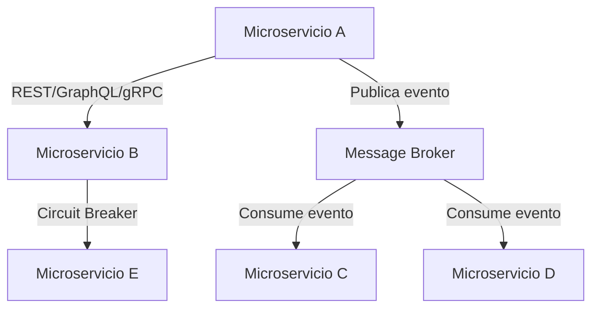

# Comunicación entre Microservicios

## ¿Qué es la comunicación entre microservicios?

La comunicación entre microservicios es cómo los diferentes servicios de tu sistema hablan entre sí para compartir datos y coordinar acciones. Es similar a cómo los miembros de un equipo necesitan hablar entre ellos para trabajar juntos.

## ¿Por qué es importante?

Un buen sistema de comunicación entre servicios es crucial porque:

- Permite que los servicios independientes trabajen juntos para resolver problemas complejos
- Ayuda a mantener los servicios desacoplados (que no dependan demasiado unos de otros)
- Influye directamente en la resistencia de tu sistema a fallos
- Impacta en el rendimiento y la escalabilidad de la aplicación

## Tipos Básicos de Comunicación

### 1. Comunicación Síncrona vs. Asíncrona

#### Comunicación Síncrona (como una llamada telefónica)

En la comunicación síncrona, un servicio hace una petición y espera la respuesta antes de continuar.

```python
# Ejemplo de comunicación síncrona con httpx
import httpx

async def get_user_details(user_id):
    # El servicio de pedidos espera a que el servicio de usuarios responda
    async with httpx.AsyncClient() as client:
        response = await client.get(f"http://user-service/users/{user_id}")
        if response.status_code == 200:
            return response.json()
        else:
            return None

# Este código no continuará hasta recibir la respuesta
user = await get_user_details(123)
if user:
    print(f"Usuario encontrado: {user['name']}")
else:
    print("Usuario no encontrado")
```

**Ventajas:**
- ✅ Fácil de entender y programar
- ✅ Flujo de control predecible
- ✅ Respuesta inmediata sobre éxito o fracaso

**Desventajas:**
- ❌ Si el servicio receptor está lento o caído, el emisor también se ralentiza
- ❌ Crea acoplamiento temporal entre servicios
- ❌ Puede crear "cascadas de fallos"

#### Comunicación Asíncrona (como enviar un correo electrónico)

En la comunicación asíncrona, un servicio envía un mensaje y continúa con su trabajo sin esperar respuesta inmediata.

```python
# Ejemplo de comunicación asíncrona con Redis Pub/Sub
import redis
import json

# Publicar un evento
def publish_order_created(order_data):
    r = redis.Redis(host='redis', port=6379)
    event = {
        "type": "ORDER_CREATED",
        "data": order_data,
        "timestamp": datetime.now().isoformat()
    }
    r.publish('orders_events', json.dumps(event))
    return "Evento publicado, continuando con otras tareas..."

# En otro servicio: consumir eventos (ejecutado en otro thread/proceso)
def start_order_listener():
    r = redis.Redis(host='redis', port=6379)
    p = r.pubsub()
    p.subscribe('orders_events')
    
    for message in p.listen():
        if message['type'] == 'message':
            event = json.loads(message['data'])
            if event['type'] == 'ORDER_CREATED':
                process_new_order(event['data'])
```

**Ventajas:**
- ✅ Los servicios están desacoplados temporalmente
- ✅ Mayor resistencia a fallos (el emisor continúa aunque el receptor falle)
- ✅ Mejor rendimiento y escalabilidad
- ✅ Mejor para operaciones que no necesitan respuesta inmediata

**Desventajas:**
- ❌ Más complejo de implementar y depurar
- ❌ Requiere infraestructura adicional (colas de mensajes, etc.)
- ❌ La consistencia eventual puede ser difícil de entender

## Patrones de Comunicación Común

### 1. API REST: Comunicación a través de HTTP

REST es el patrón más común y usa HTTP como protocolo de comunicación.

```python
# Implementación de un endpoint REST con FastAPI
from fastapi import FastAPI, HTTPException
from pydantic import BaseModel

app = FastAPI()

class Product(BaseModel):
    id: int
    name: str
    price: float
    stock: int

# Base de datos simulada
products_db = {
    1: Product(id=1, name="Smartphone", price=299.99, stock=10),
    2: Product(id=2, name="Laptop", price=899.99, stock=5)
}

@app.get("/products/{product_id}", response_model=Product)
async def get_product(product_id: int):
    if product_id not in products_db:
        raise HTTPException(status_code=404, detail="Producto no encontrado")
    return products_db[product_id]

# Cliente REST en otro servicio
async def get_product_details(product_id):
    async with httpx.AsyncClient() as client:
        response = await client.get(f"http://product-service/products/{product_id}")
        response.raise_for_status()  # Lanza excepción si hay error
        return response.json()
```

**Cuándo usar REST:**
- Para operaciones CRUD simples (crear, leer, actualizar, eliminar)
- Cuando necesitas una API que también será usada por clientes externos
- En servicios que siguen naturalmente un modelo de recursos

### 2. GraphQL: Consultando sólo lo que necesitas

GraphQL permite a los clientes especificar exactamente qué datos necesitan.

```python
# Implementación de GraphQL con Strawberry
import strawberry
from strawberry.asgi import GraphQL

@strawberry.type
class User:
    id: str
    name: str
    email: str

@strawberry.type
class Query:
    @strawberry.field
    def user(self, id: str) -> User:
        # Simulando recuperación de usuario
        return User(id=id, name="Ana García", email="ana@ejemplo.com")

schema = strawberry.Schema(query=Query)
app = GraphQL(schema)

# Cliente GraphQL desde otro servicio
async def get_user_email_only(user_id):
    query = """
    query {
        user(id: "%s") {
            email  # Sólo pedimos el email, no todo el objeto
        }
    }
    """ % user_id
    
    async with httpx.AsyncClient() as client:
        response = await client.post(
            "http://user-service/graphql",
            json={"query": query}
        )
        return response.json()["data"]["user"]["email"]
```

**Cuándo usar GraphQL:**
- Cuando diferentes clientes necesitan diferentes subconjuntos de datos
- Para reducir el número de llamadas entre servicios
- En interfaces complejas con información anidada

### 3. gRPC: Comunicación de Alto Rendimiento

gRPC usa buffers de protocolo para una comunicación eficiente y fuertemente tipada.

```protobuf
// user.proto
syntax = "proto3";

service UserService {
  rpc GetUser (UserRequest) returns (UserResponse) {}
}

message UserRequest {
  string id = 1;
}

message UserResponse {
  string id = 1;
  string name = 2;
  string email = 3;
}
```

```python
# Implementación del servidor gRPC
import grpc
from concurrent import futures
import user_pb2
import user_pb2_grpc

class UserServicer(user_pb2_grpc.UserServiceServicer):
    def GetUser(self, request, context):
        # Simulando búsqueda de usuario
        return user_pb2.UserResponse(
            id=request.id,
            name="Ana García",
            email="ana@ejemplo.com"
        )

def serve():
    server = grpc.server(futures.ThreadPoolExecutor(max_workers=10))
    user_pb2_grpc.add_UserServiceServicer_to_server(UserServicer(), server)
    server.add_insecure_port('[::]:50051')
    server.start()
    server.wait_for_termination()

# Cliente gRPC desde otro servicio
def get_user(user_id):
    with grpc.insecure_channel('user-service:50051') as channel:
        stub = user_pb2_grpc.UserServiceStub(channel)
        response = stub.GetUser(user_pb2.UserRequest(id=user_id))
        return {
            "id": response.id,
            "name": response.name,
            "email": response.email
        }
```

**Cuándo usar gRPC:**
- Para comunicación de alto rendimiento entre microservicios internos
- Cuando necesitas contratos fuertemente tipados
- Para streaming de datos entre servicios

### 4. Comunicación Basada en Eventos: Mensajes y Publicación/Suscripción

Este patrón utiliza eventos para comunicar cambios de estado entre servicios.

```python
# Productor de eventos con Kafka
from kafka import KafkaProducer
import json

def publish_user_registered(user_data):
    producer = KafkaProducer(
        bootstrap_servers=['kafka:9092'],
        value_serializer=lambda v: json.dumps(v).encode('utf-8')
    )
    
    producer.send('user-events', {
        'event_type': 'USER_REGISTERED',
        'data': user_data
    })
    producer.flush()
    
# Consumidor de eventos en otro servicio
from kafka import KafkaConsumer
import json

def start_user_event_consumer():
    consumer = KafkaConsumer(
        'user-events',
        bootstrap_servers=['kafka:9092'],
        value_deserializer=lambda m: json.loads(m.decode('utf-8'))
    )
    
    for message in consumer:
        event = message.value
        if event['event_type'] == 'USER_REGISTERED':
            # Por ejemplo, enviar email de bienvenida
            send_welcome_email(event['data']['email'])
```

**Cuándo usar comunicación basada en eventos:**
- Para notificar a múltiples servicios sobre cambios
- Para desacoplar servicios (emisor no necesita conocer al receptor)
- Para implementar patrones como Event Sourcing o CQRS

## Estrategias para Servicios Resilientes

### 1. Manejando Fallos con Circuit Breaker

El patrón Circuit Breaker previene que un servicio siga intentando llamar a otro servicio que está fallando.

```python
import time
from functools import wraps

class CircuitBreaker:
    def __init__(self, failure_threshold=5, recovery_time=30):
        self.failure_threshold = failure_threshold
        self.recovery_time = recovery_time
        self.failures = 0
        self.state = "CLOSED"  # CLOSED=normal, OPEN=no intentar, HALF-OPEN=probar
        self.last_failure_time = None
        
    def __call__(self, func):
        @wraps(func)
        async def wrapper(*args, **kwargs):
            if self.state == "OPEN":
                # Verificar si ha pasado el tiempo de recuperación
                if time.time() - self.last_failure_time >= self.recovery_time:
                    self.state = "HALF-OPEN"
                else:
                    # Lanzar error o usar fallback
                    raise Exception("Circuit breaker abierto")
            
            try:
                result = await func(*args, **kwargs)
                
                # Si estamos en medio-abierto y funciona, resetear
                if self.state == "HALF-OPEN":
                    self.reset()
                    
                return result
                
            except Exception as e:
                self.failures += 1
                self.last_failure_time = time.time()
                
                if self.failures >= self.failure_threshold:
                    self.state = "OPEN"
                    
                raise e
                
        def reset(self):
            self.failures = 0
            self.state = "CLOSED"
            self.last_failure_time = None
            
        wrapper.reset = reset
        return wrapper

# Uso:
order_circuit = CircuitBreaker(failure_threshold=3, recovery_time=60)

@order_circuit
async def get_product(product_id):
    async with httpx.AsyncClient() as client:
        response = await client.get(f"http://product-service/products/{product_id}")
        response.raise_for_status()
        return response.json()
```

### 2. Timeout y Retry

Establecer tiempos de espera apropiados y reintentar con backoff exponencial.

```python
import asyncio
import random

async def fetch_with_retry(url, max_retries=3, timeout=1.0):
    retries = 0
    
    while retries <= max_retries:
        try:
            async with httpx.AsyncClient() as client:
                # Usar timeout para no esperar indefinidamente
                response = await client.get(url, timeout=timeout)
                response.raise_for_status()
                return response.json()
        except (httpx.HTTPError, asyncio.TimeoutError) as error:
            retries += 1
            
            if retries > max_retries:
                raise Exception(f"Máximo de reintentos alcanzado: {error}")
                
            # Espera exponencial con jitter para evitar tormentas de tráfico
            delay = (2 ** retries) + random.uniform(0, 1)
            print(f"Reintento {retries} después de {delay:.2f} segundos")
            await asyncio.sleep(delay)
```

## Eligiendo el Patrón Adecuado

Para elegir el patrón más adecuado, considera:

| Si necesitas... | Considera usar... |
|-----------------|-------------------|
| Comunicación simple, fácil de implementar | REST |
| Precisión en los datos que solicitas | GraphQL |
| Alto rendimiento y contratos estrictos | gRPC |
| Desacoplamiento completo entre servicios | Comunicación basada en eventos |
| Operaciones que no son urgentes | Comunicación asíncrona |
| Respuesta inmediata y confirmación | Comunicación síncrona |

## Resumen Visual



## Preguntas de Reflexión

1. ¿Qué tipo de comunicación (síncrona o asíncrona) sería más adecuada para un sistema de procesamiento de pagos? ¿Y para un sistema de notificaciones?

2. Piensa en una aplicación que hayas desarrollado anteriormente. ¿Cómo cambiaría su arquitectura si la dividieras en microservicios? ¿Qué patrones de comunicación usarías?

3. ¿Qué estrategias de resiliencia implementarías en un sistema crítico donde la disponibilidad es crucial? 