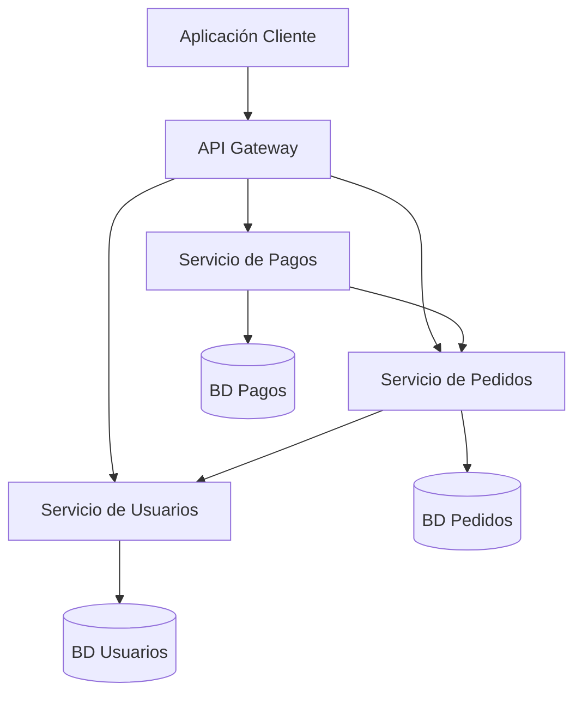

# Arquitectura de Microservicios

La arquitectura de microservicios es un enfoque para desarrollar una aplicación como un conjunto de pequeños servicios independientes, cada uno ejecutándose en su propio proceso y comunicándose mediante mecanismos ligeros, generalmente APIs basadas en HTTP.

## ¿Qué son los Microservicios?

En una arquitectura de microservicios:

- Los servicios son pequeños, enfocados en hacer una cosa bien
- Cada servicio se ejecuta en su propio proceso
- Los servicios se comunican a través de APIs bien definidas
- Los servicios son desplegables y escalables de forma independiente
- Cada servicio puede tener su propia base de datos o almacenamiento de datos
- Los servicios se organizan en torno a capacidades de negocio

## Microservicios vs. Monolitos

Los microservicios representan una evolución del enfoque monolítico tradicional:

| Aspecto | Arquitectura Monolítica | Arquitectura de Microservicios |
|--------|------------------------|----------------------------|
| Estructura | Base de código única y unificada | Múltiples servicios independientes |
| Despliegue | Despliegue de toda la aplicación | Despliegue de servicios individuales |
| Escalado | Escalar toda la aplicación | Escalar servicios específicos según sea necesario |
| Tecnología | Generalmente una sola pila tecnológica | Puede usar diferentes tecnologías por servicio |
| Base de datos | Típicamente base de datos compartida | Cada servicio puede tener su propia base de datos |
| Organización del equipo | Equipos centralizados por capa | Equipos organizados en torno a servicios |
| Velocidad de desarrollo | Más lenta a medida que crece la aplicación | Los equipos pueden desarrollar de forma independiente |
| Complejidad | Más simple inicialmente, más compleja después | Más compleja inicialmente, manejable después |

## Beneficios de los Microservicios

- **Escalado independiente**: Escalar solo los servicios que lo necesitan
- **Flexibilidad tecnológica**: Elegir la herramienta adecuada para cada trabajo
- **Resiliencia**: Un fallo en un servicio no derriba todo el sistema
- **Independencia de despliegue**: Desplegar servicios sin afectar a otros
- **Autonomía de equipo**: Los equipos pueden poseer y desarrollar servicios independientemente
- **Mantenimiento más fácil**: Las bases de código más pequeñas y enfocadas son más fáciles de entender

## Desafíos de los Microservicios

- **Complejidad de sistemas distribuidos**: Llamadas de red, latencia y manejo de fallos
- **Consistencia de datos**: Mantener la consistencia entre servicios es un desafío
- **Sobrecarga operativa**: Más servicios significan más despliegue, monitoreo y registro
- **Coordinación de servicios**: Gestión de dependencias entre servicios
- **Pruebas**: Las pruebas de extremo a extremo se vuelven más complejas

## Diagrama de Arquitectura de Microservicios

## Cuándo usar Microservicios

Los microservicios son adecuados para:

- Aplicaciones grandes y complejas que necesitan escalar
- Organizaciones con múltiples equipos trabajando en diferentes partes de una aplicación
- Aplicaciones que requieren cambios y despliegues frecuentes
- Sistemas donde diferentes componentes tienen diferentes necesidades de escalado

Sin embargo, pueden ser excesivos para:

- Aplicaciones simples con alcance limitado
- Equipos pequeños con recursos operativos limitados
- Aplicaciones sin límites de dominio claros
- Startups en etapa temprana enfocadas en iteración rápida

## Microservicios en la Práctica

En las siguientes secciones, exploraremos aspectos clave de la implementación de microservicios:

1. [Principios de Diseño](principles.md) - Guías para un diseño efectivo de microservicios
2. [Patrones de Comunicación](communication.md) - Cómo interactúan los servicios entre sí
3. [Estrategias de Despliegue](deployment.md) - Enfoques para desplegar microservicios

También examinaremos ejemplos prácticos en Python y TypeScript que muestran cómo se aplican estos conceptos en escenarios de desarrollo del mundo real. 