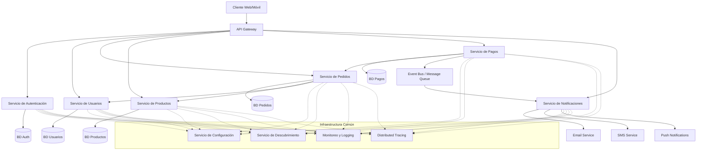

# Arquitectura de Microservicios

La arquitectura de microservicios es un enfoque para desarrollar una aplicación como un conjunto de pequeños servicios independientes, cada uno ejecutándose en su propio proceso y comunicándose mediante mecanismos ligeros, generalmente APIs basadas en HTTP.

## ¿Qué son los Microservicios?

En una arquitectura de microservicios:

- Los servicios son pequeños, enfocados en hacer una cosa bien
- Cada servicio se ejecuta en su propio proceso
- Los servicios se comunican a través de APIs bien definidas
- Los servicios son desplegables y escalables de forma independiente
- Cada servicio puede tener su propia base de datos o almacenamiento de datos
- Los servicios se organizan en torno a capacidades de negocio

## Microservicios vs. Monolitos

Los microservicios representan una evolución del enfoque monolítico tradicional:

| Aspecto | Arquitectura Monolítica | Arquitectura de Microservicios |
|--------|------------------------|----------------------------|
| Estructura | Base de código única y unificada | Múltiples servicios independientes |
| Despliegue | Despliegue de toda la aplicación | Despliegue de servicios individuales |
| Escalado | Escalar toda la aplicación | Escalar servicios específicos según sea necesario |
| Tecnología | Generalmente una sola pila tecnológica | Puede usar diferentes tecnologías por servicio |
| Base de datos | Típicamente base de datos compartida | Cada servicio puede tener su propia base de datos |
| Organización del equipo | Equipos centralizados por capa | Equipos organizados en torno a servicios |
| Velocidad de desarrollo | Más lenta a medida que crece la aplicación | Los equipos pueden desarrollar de forma independiente |
| Complejidad | Más simple inicialmente, más compleja después | Más compleja inicialmente, manejable después |

## Beneficios de los Microservicios

- **Escalado independiente**: Escalar solo los servicios que lo necesitan
- **Flexibilidad tecnológica**: Elegir la herramienta adecuada para cada trabajo
- **Resiliencia**: Un fallo en un servicio no derriba todo el sistema
- **Independencia de despliegue**: Desplegar servicios sin afectar a otros
- **Autonomía de equipo**: Los equipos pueden poseer y desarrollar servicios independientemente
- **Mantenimiento más fácil**: Las bases de código más pequeñas y enfocadas son más fáciles de entender

## Desafíos de los Microservicios

- **Complejidad de sistemas distribuidos**: Llamadas de red, latencia y manejo de fallos
- **Consistencia de datos**: Mantener la consistencia entre servicios es un desafío
- **Sobrecarga operativa**: Más servicios significan más despliegue, monitoreo y registro
- **Coordinación de servicios**: Gestión de dependencias entre servicios
- **Pruebas**: Las pruebas de extremo a extremo se vuelven más complejas

## Arquitectura de Referencia Completa

El siguiente diagrama muestra una arquitectura de microservicios completa con todos los componentes clave:



## Estructura de Proyecto Típica para Microservicios

Una estructura de proyecto de microservicios bien organizada puede facilitar enormemente la gestión del código. A continuación se muestra una estructura de proyecto recomendada para una aplicación de microservicios:

```
e-commerce-microservices/
│
├── api-gateway/                   # API Gateway
│   ├── src/                       # Código fuente
│   ├── tests/                     # Pruebas
│   ├── Dockerfile                 # Configuración de Docker
│   ├── package.json               # Dependencias (si es Node.js)
│   └── requirements.txt           # Dependencias (si es Python)
│
├── user-service/                  # Servicio de Usuarios
│   ├── src/
│   │   ├── api/                   # Controladores de API
│   │   ├── core/                  # Lógica de dominio
│   │   ├── infrastructure/        # Acceso a datos, clientes externos
│   │   └── main.py               # Punto de entrada
│   ├── tests/
│   ├── Dockerfile
│   └── requirements.txt
│
├── order-service/                 # Servicio de Pedidos
│   ├── src/
│   │   ├── api/
│   │   ├── core/
│   │   ├── infrastructure/
│   │   └── main.py
│   ├── tests/
│   ├── Dockerfile
│   └── requirements.txt
│
├── product-service/               # Servicio de Productos
│   ├── src/
│   │   ├── api/
│   │   ├── core/
│   │   ├── infrastructure/
│   │   └── main.py
│   ├── tests/
│   ├── Dockerfile
│   └── requirements.txt
│
├── payment-service/               # Servicio de Pagos
│   ├── src/
│   │   ├── api/
│   │   ├── core/
│   │   ├── infrastructure/
│   │   └── main.py
│   ├── tests/
│   ├── Dockerfile
│   └── requirements.txt
│
├── notification-service/          # Servicio de Notificaciones
│   ├── src/
│   │   ├── api/
│   │   ├── core/
│   │   ├── infrastructure/
│   │   └── main.py
│   ├── tests/
│   ├── Dockerfile
│   └── requirements.txt
│
├── shared-lib/                    # Bibliotecas compartidas (con cuidado)
│   ├── python/                    # Bibliotecas Python
│   └── typescript/                # Bibliotecas TypeScript
│
├── infrastructure/                # Configuración de infraestructura
│   ├── kubernetes/                # Configuración de Kubernetes
│   ├── terraform/                 # Scripts de Terraform
│   ├── prometheus/                # Configuración de monitoreo
│   └── logging/                   # Configuración de logging
│
├── docker-compose.yml             # Configuración para desarrollo local
├── .github/                       # Configuración de CI/CD
└── README.md                      # Documentación general
```

Cada servicio individual sigue una estructura interna consistente:

```
service-name/
├── src/
│   ├── api/                       # Capa de API
│   │   ├── controllers/           # Controladores de endpoints
│   │   ├── middleware/            # Middleware (autenticación, validación)
│   │   ├── dto/                   # Data Transfer Objects
│   │   └── routes.py              # Definición de rutas
│   │
│   ├── core/                      # Lógica de negocio/dominio
│   │   ├── models/                # Modelos de dominio
│   │   ├── services/              # Servicios de aplicación
│   │   └── exceptions/            # Excepciones de dominio
│   │
│   ├── infrastructure/            # Infraestructura técnica
│   │   ├── database/              # Acceso a base de datos
│   │   │   ├── repositories/      # Implementaciones de repositorios
│   │   │   └── models/            # Modelos ORM
│   │   ├── messaging/             # Comunicación con message brokers
│   │   ├── clients/               # Clientes para otros servicios
│   │   └── config/                # Configuración
│   │
│   └── main.py                    # Punto de entrada principal
│
├── tests/                         # Tests organizados en estructura similar
│   ├── unit/
│   ├── integration/
│   └── e2e/
│
├── Dockerfile                     # Configuración de Docker
├── requirements.txt               # Dependencias
└── README.md                      # Documentación específica del servicio
```

## Recomendaciones para la Implementación

Para implementar microservicios efectivamente:

1. **Utiliza API gateways**: para manejar aspectos transversales como autenticación, rate limiting y routing
2. **Implementa circuit breakers**: para prevenir fallos en cascada cuando un servicio falla
3. **Adopta observabilidad**: con logging centralizado, monitoreo y tracing distribuido
4. **Automatiza despliegues**: con CI/CD pipelines e infraestructura como código
5. **Usa contenedores y orquestación**: Docker y Kubernetes facilitan la gestión de microservicios
6. **Implementa comunicación asíncrona**: donde sea apropiado para reducir el acoplamiento
7. **Define contratos de API claros**: con herramientas como OpenAPI/Swagger
8. **Establece patrones consistentes**: entre diferentes servicios para facilitar el aprendizaje

## Cuándo usar Microservicios

Los microservicios son adecuados para:

- Aplicaciones grandes y complejas que necesitan escalar
- Organizaciones con múltiples equipos trabajando en diferentes partes de una aplicación
- Aplicaciones que requieren cambios y despliegues frecuentes
- Sistemas donde diferentes componentes tienen diferentes necesidades de escalado

Sin embargo, pueden ser excesivos para:

- Aplicaciones simples con alcance limitado
- Equipos pequeños con recursos operativos limitados
- Aplicaciones sin límites de dominio claros
- Startups en etapa temprana enfocadas en iteración rápida

## Microservicios en la Práctica

En las siguientes secciones, exploraremos aspectos clave de la implementación de microservicios:

1. [Principios de Diseño](principles.md) - Guías para un diseño efectivo de microservicios
2. [Patrones de Comunicación](communication.md) - Cómo interactúan los servicios entre sí
3. [Estrategias de Despliegue](deployment.md) - Enfoques para desplegar microservicios
4. [Estructura de Código](code-structure.md) - Organización del código dentro de un microservicio
5. [Ejemplo de Implementación](example-implementation.md) - Ejemplo práctico de microservicios con FastAPI y Express 