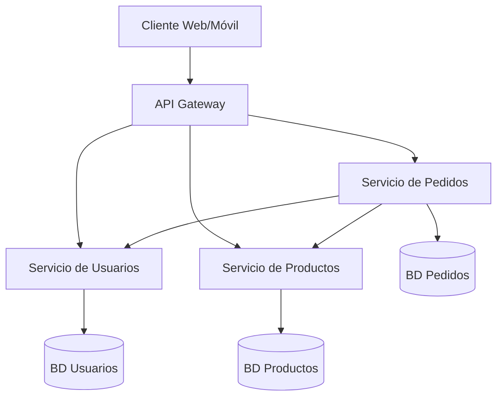

# Arquitectura de Microservicios

La arquitectura de microservicios es un enfoque para desarrollar aplicaciones como un conjunto de pequeños servicios independientes. Este documento está diseñado para ayudarte a entender este concepto desde cero.

## ¿Qué son los Microservicios?

Imagina una aplicación como una ciudad: en lugar de construir un único edificio enorme (monolito) que alberga todo, los microservicios son como pequeños edificios especializados que trabajan juntos.

**Definición práctica:** Los microservicios son pequeñas aplicaciones independientes que:
- Se enfocan en hacer **una sola cosa** muy bien
- Se ejecutan como procesos separados
- Se comunican entre sí mediante APIs (generalmente HTTP/REST)
- Tienen su propia base de datos o almacenamiento
- Pueden desplegarse y escalarse individualmente



## Microservicios vs. Monolitos

Los microservicios representan una evolución del enfoque monolítico tradicional:

| Aspecto | Aplicación Monolítica | Arquitectura de Microservicios | Lo que significa para el desarrollo |
|--------|------------------------|----------------------------|------------------------------------------|
| Estructura | Todo el código en una aplicación | Múltiples aplicaciones pequeñas | Trabajarás con bases de código más pequeñas y enfocadas |
| Despliegue | Se despliega toda la aplicación | Despliegue independiente de servicios | Puedes actualizar una parte sin arriesgar todo el sistema |
| Escalado | Se escala toda la aplicación | Se escala cada servicio según necesidad | Mayor eficiencia de recursos y costos |
| Tecnología | Una sola pila tecnológica | Diferentes tecnologías por servicio | Puedes elegir la herramienta correcta para cada trabajo |
| Base de datos | Generalmente una base compartida | Cada servicio con su propia base de datos | Mayor independencia pero más complejidad para consultas complejas |
| Desarrollo | Todos trabajan en el mismo código | Equipos enfocados en servicios específicos | Menor conflicto de código y mayor autonomía |

## ¿Qué problema resuelven los microservicios?

Los microservicios nacieron para resolver problemas comunes de las aplicaciones monolíticas grandes:

| Problema del Monolito | Solución con Microservicios | Ejemplo práctico |
|------------------------|----------------------------|--------------------|
| Cambiar una parte requiere desplegar todo | Despliegues independientes | Puedes actualizar el sistema de pagos sin tocar otros módulos |
| Todo debe usar la misma tecnología | Cada servicio elige su tecnología | El equipo de IA puede usar Python mientras el de pagos usa Node.js |
| Una falla puede derribar toda la aplicación | Fallos aislados | Si el sistema de recomendaciones falla, los usuarios aún pueden comprar |
| Código difícil de entender para nuevos miembros | Servicios pequeños y enfocados | Un nuevo desarrollador puede dominar un servicio sin entender todo el sistema |
| Escalado todo-o-nada | Escalado selectivo | Puedes escalar solo el servicio de procesamiento de imágenes durante subidas masivas de fotos |

## Relación con conocimientos existentes

Los microservicios se basan en conceptos que probablemente ya dominas:

- **API REST**: Los microservicios usan APIs REST para comunicarse, igual que las APIs que ya has creado o consumido
- **Bases de datos**: Cada microservicio gestiona su propia base de datos, similar a cómo trabajas con bases de datos en aplicaciones tradicionales
- **Contenedores Docker**: Los microservicios suelen desplegarse como contenedores, facilitando la consistencia entre entornos
- **Programación Orientada a Objetos**: Cada microservicio encapsula su funcionalidad, similar a cómo una clase bien diseñada encapsula sus datos y comportamiento

## Beneficios de los Microservicios

- **Despliegues más seguros**: Un cambio afecta solo a un servicio, no a toda la aplicación
- **Independencia tecnológica**: Cada equipo puede elegir las herramientas que mejor se adapten a su problema
- **Escalado más eficiente**: Escala solo lo que necesita más recursos
- **Desarrollo en paralelo**: Diferentes equipos pueden trabajar en diferentes servicios simultáneamente
- **Código más mantenible**: Bases de código más pequeñas son más fáciles de entender y mantener

## Desafíos de los Microservicios

- **Mayor complejidad operativa**: Más servicios significan más cosas que monitorear y mantener
- **Comunicación entre servicios**: Gestionar llamadas de red, latencia y fallos entre servicios
- **Consistencia de datos**: Mantener datos coherentes entre múltiples bases de datos
- **Curva de aprendizaje**: Requiere comprender sistemas distribuidos y herramientas adicionales
- **Sobrecarga de red**: Las llamadas entre servicios introducen latencia y potenciales puntos de fallo

## Ejemplo Sencillo: Sistema de E-commerce

Para ilustrar mejor, veamos un sistema de e-commerce básico implementado con microservicios:

### Servicio de Usuarios
```python
# app/main.py en servicio-usuarios
from fastapi import FastAPI, HTTPException

app = FastAPI()

# Base de datos simulada (en una implementación real sería una base de datos)
users_db = {
    1: {"id": 1, "name": "Ana García", "email": "ana@ejemplo.com"},
    2: {"id": 2, "name": "Juan López", "email": "juan@ejemplo.com"}
}

@app.get("/users/{user_id}")
async def get_user(user_id: int):
    if user_id not in users_db:
        raise HTTPException(status_code=404, detail="Usuario no encontrado")
    return users_db[user_id]
```

### Servicio de Productos
```python
# app/main.py en servicio-productos
from fastapi import FastAPI, HTTPException

app = FastAPI()

# Base de datos simulada
products_db = {
    1: {"id": 1, "name": "Smartphone", "price": 299.99, "stock": 10},
    2: {"id": 2, "name": "Laptop", "price": 899.99, "stock": 5}
}

@app.get("/products/{product_id}")
async def get_product(product_id: int):
    if product_id not in products_db:
        raise HTTPException(status_code=404, detail="Producto no encontrado")
    return products_db[product_id]
```

### Servicio de Pedidos
```python
# app/main.py en servicio-pedidos
import httpx
from fastapi import FastAPI, HTTPException

app = FastAPI()

# Base de datos simulada
orders_db = {}
order_counter = 1

@app.post("/orders")
async def create_order(order_data: dict):
    global order_counter
    
    # Verificar usuario llamando al Servicio de Usuarios
    async with httpx.AsyncClient() as client:
        try:
            user_response = await client.get(f"http://servicio-usuarios:8000/users/{order_data['user_id']}")
            user_response.raise_for_status()  # Lanza error si el status code no es 200
            
            product_response = await client.get(f"http://servicio-productos:8000/products/{order_data['product_id']}")
            product_response.raise_for_status()
        except httpx.HTTPStatusError as e:
            raise HTTPException(status_code=400, detail=f"Error al verificar datos: {str(e)}")
    
    user = user_response.json()
    product = product_response.json()
    
    # En un sistema real, aquí verificaríamos stock y actualizaríamos inventario
    
    # Crear el pedido
    new_order = {
        "id": order_counter,
        "user": user,
        "product": product,
        "quantity": order_data.get("quantity", 1),
        "total": product["price"] * order_data.get("quantity", 1)
    }
    
    orders_db[order_counter] = new_order
    order_counter += 1
    
    return new_order
```

## ¿Cuándo usar microservicios?

👍 **Considera microservicios cuando**:
- Tu aplicación es compleja y tiene partes claramente separables
- Diferentes componentes necesitan escalar de manera diferente
- Tienes múltiples equipos trabajando en paralelo
- La velocidad de desarrollo se ha ralentizado debido al tamaño del código

👎 **Evita microservicios cuando**:
- Tu aplicación es pequeña o simple
- Tienes un equipo pequeño o recursos operativos limitados
- Necesitas iteración rápida en las primeras etapas de una startup
- No tienes fronteras claras entre las funcionalidades de la aplicación

## Estructura de Proyecto Recomendada con DDD

Una estructura de proyecto bien organizada facilita el desarrollo de microservicios siguiendo los principios de Domain-Driven Design (DDD). Aquí hay un ejemplo de estructura para un microservicio individual:

```
microservicio-producto/
├── src/
│   ├── application/              # Capa de aplicación
│   │   ├── commands/             # Comandos (modifican estado)
│   │   │   ├── create_product.py
│   │   │   └── update_stock.py
│   │   ├── queries/              # Consultas (solo lectura)
│   │   │   ├── get_product.py
│   │   │   └── search_products.py
│   │   └── dto/                  # Data Transfer Objects
│   │       ├── product_dto.py
│   │       └── category_dto.py
│   │
│   ├── domain/                   # Capa de dominio (DDD core)
│   │   ├── entities/             # Entidades de dominio
│   │   │   ├── product.py
│   │   │   └── category.py
│   │   ├── value_objects/        # Objetos de valor inmutables
│   │   │   ├── money.py
│   │   │   └── product_id.py
│   │   ├── aggregates/           # Agregados (múltiples entidades)
│   │   │   └── product_aggregate.py
│   │   ├── repositories/         # Interfaces de repositorios
│   │   │   └── product_repository.py
│   │   ├── services/             # Servicios de dominio
│   │   │   └── pricing_service.py
│   │   └── events/               # Eventos de dominio
│   │       └── product_events.py
│   │
│   ├── infrastructure/           # Capa de infraestructura
│   │   ├── persistence/          # Implementaciones de persistencia
│   │   │   ├── sqlalchemy/       # Adaptador específico
│   │   │   │   ├── models.py     # Modelos ORM
│   │   │   │   └── repositories/ # Implementaciones de repos
│   │   │   │       └── sqlalchemy_product_repository.py
│   │   │   └── in_memory/        # Para testing
│   │   │       └── in_memory_product_repository.py
│   │   ├── messaging/            # Comunicación entre servicios
│   │   │   ├── producers/
│   │   │   └── consumers/
│   │   └── api/                  # Controladores de API
│   │       ├── rest/             # API REST
│   │       │   ├── controllers/
│   │       │   └── schemas/      # Esquemas de validación
│   │       └── graphql/          # API GraphQL (opcional)
│   │
│   ├── config/                   # Configuración de la aplicación
│   │   ├── settings.py
│   │   └── container.py          # Configuración de DI
│   │
│   └── main.py                   # Punto de entrada
│
├── tests/                        # Tests organizados en capas
│   ├── unit/                     # Pruebas unitarias
│   │   ├── domain/
│   │   └── application/
│   │
│   ├── integration/              # Pruebas de integración
│   │   └── infrastructure/
│   └── e2e/                      # Pruebas de extremo a extremo
│
├── Dockerfile                    # Configuración Docker
├── docker-compose.yml            # Para desarrollo local
├── requirements.txt              # Dependencias
├── mypy.ini                      # Configuración de tipado estático
└── README.md                     # Documentación del servicio
```

### Explicación de las Capas DDD

1. **Capa de Dominio**: El corazón de DDD, contiene:
   - **Entidades**: Objetos con identidad y ciclo de vida (ej: `Product`, `Order`)
   - **Objetos de Valor**: Inmutables, sin identidad (ej: `Money`, `Address`)
   - **Agregados**: Grupos de entidades tratadas como unidad (ej: `Order` con `OrderItems`)
   - **Repositorios**: Interfaces para persistencia (implementadas en infraestructura)
   - **Servicios de Dominio**: Lógica que no pertenece a entidades específicas

2. **Capa de Aplicación**: Coordina el flujo de la aplicación:
   - **Comandos**: Modifican el estado (Create, Update, Delete)
   - **Consultas**: Obtienen datos sin modificar estado (Read)
   - **DTOs**: Objetos para transferencia de datos

3. **Capa de Infraestructura**: Implementa detalles técnicos:
   - **Persistencia**: Implementaciones de repositorios (DB, cache, etc.)
   - **Mensajería**: Comunicación entre servicios (Kafka, RabbitMQ)
   - **API**: Controladores HTTP, GraphQL, etc.

Este modelo facilita:
- Enfocarse en el dominio de negocio
- Independencia de la tecnología (la infraestructura es intercambiable)
- Testabilidad en todos los niveles
- Organización coherente y comprensible

## Preguntas de Reflexión

1. En tu aplicación actual, ¿qué partes podrían funcionar como servicios independientes?
2. ¿Qué retos crees que presentaría dividir una aplicación monolítica existente en microservicios?
3. ¿Cómo cambiaría tu proceso de desarrollo si trabajaras con un equipo responsable de un solo microservicio?

## Secciones Adicionales

En las siguientes secciones, exploraremos en detalle los aspectos clave de la implementación de microservicios:

1. [Principios de Diseño](principles.md) - Guías para un diseño efectivo de microservicios
2. [Patrones de Comunicación](communication.md) - Cómo interactúan los servicios entre sí
3. [Estrategias de Despliegue](deployment.md) - Enfoques para desplegar microservicios
4. [Estructura de Código](code-structure.md) - Organización del código dentro de un microservicio
5. [Ejemplo de Implementación](example-implementation.md) - Ejemplo práctico de microservicios con FastAPI y Express
6. Patrones de Resiliencia
   - [Circuit Breaker](resilience-patterns/circuit-breaker.md) - Cómo prevenir fallos en cascada 