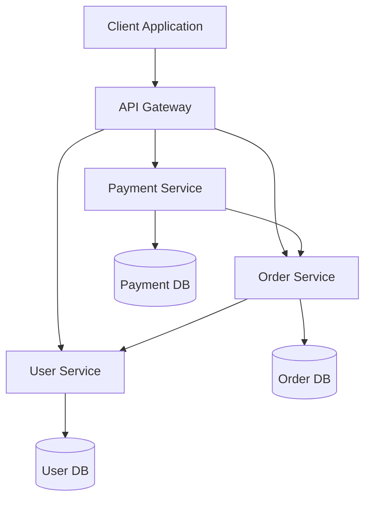

# Microservices Architecture

Microservices architecture is an approach to developing a single application as a suite of small, independently deployable services, each running in its own process and communicating via lightweight mechanisms, often HTTP-based APIs.

## What Are Microservices?

In a microservices architecture:

- Services are small, focused on doing one thing well
- Each service runs in its own process
- Services communicate via well-defined APIs
- Services are independently deployable and scalable
- Each service can have its own database or data storage
- Services are organized around business capabilities

## Microservices vs. Monoliths

Microservices represent an evolution from the traditional monolithic approach:

| Aspect | Monolithic Architecture | Microservices Architecture |
|--------|------------------------|----------------------------|
| Structure | Single, unified codebase | Multiple independent services |
| Deployment | Deploy entire application | Deploy individual services |
| Scaling | Scale the entire application | Scale specific services as needed |
| Technology | Usually one tech stack | Can use different technologies per service |
| Database | Typically shared database | Each service can have its own database |
| Team Organization | Centralized teams by layer | Teams organized around services |
| Development Speed | Slower as application grows | Teams can develop independently |
| Complexity | Simpler initially, more complex later | More complex initially, manageable later |

## Benefits of Microservices

- **Independent Scaling**: Scale only the services that need it
- **Technology Flexibility**: Choose the right tool for each job
- **Resilience**: Failure in one service doesn't bring down the entire system
- **Deployment Independence**: Deploy services without affecting others
- **Team Autonomy**: Teams can own and develop services independently
- **Easier Maintenance**: Smaller, focused codebases are easier to understand

## Challenges of Microservices

- **Distributed System Complexity**: Network calls, latency, and failure handling
- **Data Consistency**: Maintaining consistency across services is challenging
- **Operational Overhead**: More services mean more deployment, monitoring, and logging
- **Service Coordination**: Managing dependencies between services
- **Testing**: End-to-end testing becomes more complex

## Microservices Architecture Diagram

## When to Use Microservices

Microservices are well-suited for:

- Large, complex applications that need to scale
- Organizations with multiple teams working on different parts of an application
- Applications requiring frequent changes and deployments
- Systems where different components have different scaling needs

However, they may be overkill for:

- Simple applications with limited scope
- Small teams with limited operational resources
- Applications without clear domain boundaries
- Early-stage startups focused on rapid iteration

## Microservices in Practice

In the following sections, we'll explore key aspects of implementing microservices:

1. [Design Principles](principles.md) - Guidelines for effective microservice design
2. [Communication Patterns](communication.md) - How services interact with each other
3. [Deployment Strategies](deployment.md) - Approaches to deploying microservices

We'll also examine practical examples in Python and TypeScript showing how these concepts apply in real-world development scenarios. 