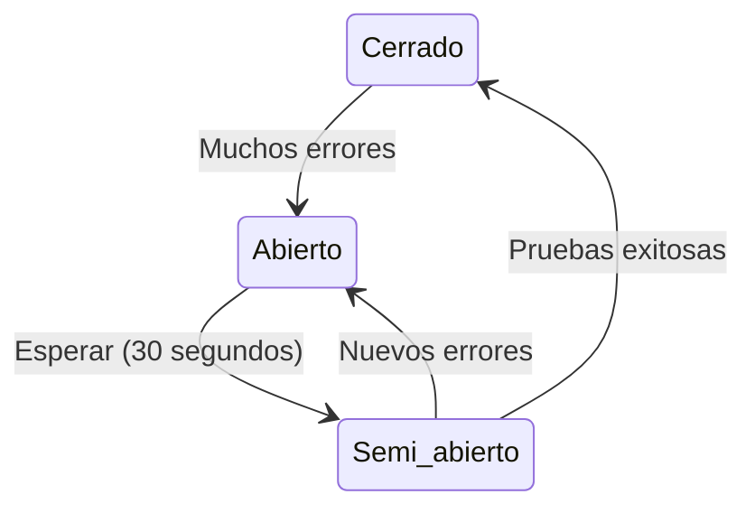

# Patrón Circuit Breaker en Microservicios

## ¿Qué es el Circuit Breaker?

Un **Circuit Breaker** (Disyuntor) es como el interruptor eléctrico de una casa: cuando detecta un problema, "corta la luz" para evitar daños mayores.

En aplicaciones de microservicios, es un mecanismo que:
- Detecta cuando un servicio está fallando
- Evita hacer más llamadas a ese servicio mientras tenga problemas
- Permite que el resto del sistema siga funcionando
- Intenta reconectar después de un tiempo

## ¿Por qué es importante?

Considere una aplicación de compras online con estos servicios:
- Servicio de productos
- Servicio de usuarios
- Servicio de pagos

Si el servicio de pagos falla y no se implementa un Circuit Breaker:
1. Los usuarios intentan comprar
2. La aplicación espera y espera al servicio de pagos
3. Los usuarios se frustran por la lentitud
4. Todo el sistema podría volverse muy lento o caerse

Con Circuit Breaker:
1. Se detecta que el servicio de pagos está fallando
2. Se "abre el circuito" para ese servicio
3. Los usuarios reciben un mensaje inmediato: "Sistema de pagos temporalmente no disponible"
4. El resto de la aplicación sigue funcionando (ver productos, añadir al carrito, etc.)

## Los 3 Estados del Circuit Breaker

El Circuit Breaker funciona como un semáforo con tres estados:

### 1. Estado Cerrado (Verde) ✅
- Todo funciona normalmente
- Las llamadas al servicio pasan sin problemas
- Se monitorea si hay errores

### 2. Estado Abierto (Rojo) ❌
- Demasiados errores detectados
- Las llamadas al servicio se bloquean inmediatamente
- La aplicación usa alternativas (como mostrar datos en caché)
- Después de un tiempo (ej. 30 segundos), pasa al estado semi-abierto

### 3. Estado Semi-abierto (Amarillo) ⚠️
- Periodo de prueba
- Se permite hacer algunas llamadas al servicio
- Si funcionan bien: vuelve al estado cerrado (verde)
- Si siguen fallando: vuelve al estado abierto (rojo)

## Diagrama Simplificado

### Cómo leer este diagrama:
- Las cajas representan los estados (Cerrado, Abierto, Semi-abierto)
- Las flechas muestran cómo cambia de un estado a otro
- El texto junto a las flechas explica cuándo ocurre el cambio

## Beneficios para las aplicaciones

1. **Fallas más rápidas**: Los usuarios reciben respuesta inmediata en lugar de esperar
2. **Protección del sistema**: Evita que un servicio lento afecte a toda la aplicación 
3. **Recuperación automática**: Intenta volver a la normalidad sin intervención manual
4. **Mejor experiencia de usuario**: Permite mostrar mensajes útiles en lugar de errores confusos

## Estrategias cuando el Circuit Breaker está abierto

Cuando el Circuit Breaker está abierto, los equipos pueden implementar:

1. **Mostrar datos guardados**: Usar una versión guardada en caché (aunque no sea la más actualizada)
2. **Ofrecer funcionalidad limitada**: "Navegación disponible, compras temporalmente deshabilitadas"
3. **Proporcionar mensajes claros**: "Servicio temporalmente no disponible. Por favor, intente de nuevo en unos minutos"

## Consideraciones para implementación

1. ¿Qué servicios críticos de la aplicación necesitan protección con Circuit Breakers?
2. ¿Cómo mejoraría la experiencia de los usuarios finales con este patrón?
3. ¿Qué alternativas se pueden ofrecer cuando un servicio no está disponible? 