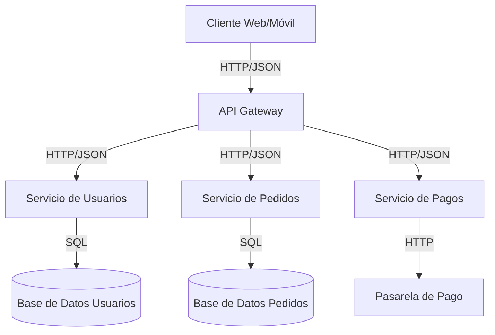

# Documentación

La documentación es un aspecto crítico pero frecuentemente subestimado en el desarrollo de software. Una documentación efectiva facilita la incorporación de nuevos miembros al equipo, mejora la mantenibilidad del código y proporciona un contexto valioso para entender decisiones arquitectónicas. Esta sección presenta las mejores prácticas para crear y mantener documentación en proyectos de software.

## Principios Fundamentales

### 1. Documentación como Código

Trata la documentación como código:

- Almacénala junto al código en el control de versiones
- Aplica revisiones y procesos de calidad similares al código
- Automatiza la generación y validación cuando sea posible

### 2. Audiencia y Propósito

Identifica claramente la audiencia y el propósito de cada documento:

- **Desarrolladores**: Detalles de implementación, APIs, patrones
- **Operadores/SRE**: Configuración, despliegue, monitoreo
- **Usuarios finales**: Uso de la aplicación, flujos de trabajo
- **Nuevos miembros del equipo**: Contexto, visión general, onboarding

### 3. Actualizaciones Continuas

La documentación desactualizada es a menudo peor que la ausencia de documentación:

- Actualiza la documentación como parte del proceso de desarrollo
- Incluye la documentación en las definiciones de "hecho" (DoD)
- Programa revisiones periódicas de la documentación existente

## Niveles de Documentación

### 1. Documentación de Código

#### Comentarios en Código

Los comentarios deben explicar el "por qué", no el "qué" o "cómo":

```python
# Mal comentario - describe lo que es obvio en el código
# Itera sobre la lista de usuarios
for usuario in usuarios:
    # ...

# Buen comentario - explica el motivo
# Procesamos los usuarios en orden alfabético para garantizar 
# resultados consistentes en las búsquedas paginadas
usuarios.sort(key=lambda u: u.nombre)
for usuario in usuarios:
    # ...
```

#### Docstrings

Documenta clases, funciones y módulos con docstrings descriptivos:

```python
def calcular_precio_total(items, codigo_descuento=None, cliente_id=None):
    """
    Calcula el precio total de una lista de items aplicando descuentos si corresponde.
    
    La función verifica si el código de descuento es válido y si el cliente tiene
    descuentos especiales asociados a su cuenta. Si ambos están presentes, se aplica
    el descuento más ventajoso para el cliente.
    
    Args:
        items (List[Item]): Lista de items a comprar.
        codigo_descuento (str, optional): Código de descuento a aplicar. Default: None.
        cliente_id (str, optional): ID del cliente para verificar descuentos asociados. Default: None.
        
    Returns:
        float: El precio total después de aplicar impuestos y descuentos.
        
    Raises:
        CodigoDescuentoInvalidoError: Si el código de descuento proporcionado no es válido.
        ClienteNoEncontradoError: Si el cliente_id no corresponde a un cliente existente.
        
    Examples:
        >>> items = [Item(id="1", precio=100), Item(id="2", precio=50)]
        >>> calcular_precio_total(items)
        150.0
        >>> calcular_precio_total(items, codigo_descuento="DESC10")
        135.0
    """
    # Implementación...
```

#### Anotaciones de Tipo

Las anotaciones de tipo mejoran la comprensión y facilitan el análisis estático:

```python
from typing import List, Optional, Dict, Any

def procesar_pedido(
    pedido_id: str,
    items: List[Dict[str, Any]],
    direccion_entrega: Optional[Dict[str, str]] = None
) -> Dict[str, Any]:
    """Procesa un pedido y retorna el resultado."""
    # Implementación...
```

### 2. Documentación de API

#### OpenAPI (Swagger)

Para APIs REST, usa OpenAPI/Swagger:

```python
# En FastAPI, la documentación se genera automáticamente
from fastapi import FastAPI, Path, Query

app = FastAPI(
    title="API de Usuarios",
    description="API para gestionar usuarios en el sistema",
    version="1.0.0"
)

@app.get(
    "/usuarios/{usuario_id}",
    summary="Obtener usuario por ID",
    description="Recupera información detallada de un usuario específico",
    response_description="Datos del usuario solicitado",
    tags=["Usuarios"]
)
async def obtener_usuario(
    usuario_id: str = Path(..., title="ID del usuario", description="ID único del usuario a recuperar"),
    incluir_pedidos: bool = Query(False, description="Si debe incluir el historial de pedidos")
):
    """
    Recupera un usuario por su ID único.
    
    - Si el usuario no existe, retorna un error 404
    - Opcionalmente puede incluir su historial de pedidos
    """
    # Implementación...
```

#### GraphQL

Para APIs GraphQL, documenta esquemas y resolvers:

```graphql
"""
Usuario registrado en el sistema.
"""
type Usuario {
  """
  Identificador único del usuario.
  """
  id: ID!
  
  """
  Nombre completo del usuario.
  """
  nombre: String!
  
  """
  Dirección de correo electrónico única del usuario.
  """
  email: String!
  
  """
  Lista de pedidos realizados por el usuario.
  """
  pedidos: [Pedido!]
}
```

### 3. Documentación de Arquitectura

#### Diagramas

Utiliza diagramas para comunicar conceptos arquitectónicos:

- **Diagramas C4**: Contexto, Contenedores, Componentes, Código
- **Diagramas UML**: Clases, Secuencia, Estado, etc.
- **Diagramas de Arquitectura**: Muestra la estructura general del sistema

```markdown
# Arquitectura del Sistema

## Diagrama de Contexto


Este diagrama muestra cómo nuestro sistema interactúa con usuarios y sistemas externos.

## Diagrama de Contenedores


```

#### Documentos de Arquitectura de Software (SAD)

Crea un documento formal de arquitectura que incluya:

- Objetivos y restricciones arquitectónicas
- Decisiones clave y sus motivaciones
- Vistas estructurales, de comportamiento y de implementación
- Escenarios de calidad y cómo son atendidos

#### Registros de Decisiones de Arquitectura (ADR)

Documenta decisiones importantes con ADRs:

```markdown
# ADR 001: Selección de GraphQL para APIs Internas

## Contexto

Necesitamos definir cómo nuestros microservicios se comunicarán entre sí. Las opciones consideradas fueron REST, gRPC y GraphQL.

## Decisión

Hemos decidido utilizar GraphQL para las APIs internas entre microservicios.

## Estado

Aceptado

## Consecuencias

### Positivas

- Flexibilidad en la consulta de datos, cada servicio puede solicitar exactamente lo que necesita
- Fuerte tipado y esquema autodocumentado
- Reducción del número de endpoints y volumen de datos transferidos

### Negativas

- Mayor complejidad inicial en la configuración
- Curva de aprendizaje para el equipo
- Posible sobrecarga para operaciones CRUD simples

## Alternativas Consideradas

- REST: Más simple pero menos flexible para consultas complejas
- gRPC: Mejor rendimiento pero menos flexibilidad y herramientas
```

### 4. Documentación Operativa

#### Guías de Despliegue

Documenta el proceso de despliegue, incluyendo:

- Requisitos previos
- Pasos detallados
- Verificaciones post-despliegue
- Procedimientos de rollback

```markdown
# Guía de Despliegue del Servicio de Usuarios

## Prerrequisitos

- Acceso al registro de contenedores
- Credenciales de Kubernetes
- Acceso a la base de datos

## Pasos de Despliegue

1. Actualizar la imagen de Docker:

```bash
docker build -t registro.ejemplo.com/usuarios:${VERSION} .
docker push registro.ejemplo.com/usuarios:${VERSION}
```

2. Aplicar configuración de Kubernetes:

```bash
# Actualizar la versión en el archivo de despliegue
sed -i "s/imagen:latest/imagen:${VERSION}/g" kubernetes/deployment.yaml

# Aplicar la configuración
kubectl apply -f kubernetes/configmap.yaml
kubectl apply -f kubernetes/secret.yaml
kubectl apply -f kubernetes/deployment.yaml
kubectl apply -f kubernetes/service.yaml
```

3. Verificar el despliegue:

```bash
kubectl rollout status deployment/usuarios
```

## Verificación Post-Despliegue

1. Verificar que los pods están en estado "Running":

```bash
kubectl get pods -l app=usuarios
```

2. Ejecutar pruebas de humo:

```bash
./scripts/smoke-test.sh ${ENVIRONMENT_URL}
```

## Procedimiento de Rollback

Si se detectan problemas, revertir a la versión anterior:

```bash
kubectl rollout undo deployment/usuarios
```
```

#### Guías de Operación

Proporciona documentación para operaciones cotidianas:

- Monitoreo y alertas
- Solución de problemas comunes
- Procedimientos de respaldo y recuperación
- Escalado del sistema

### 5. Documentación para Onboarding

#### Guía de Primeros Pasos

Facilita la incorporación de nuevos miembros al equipo:

```markdown
# Guía de Primeros Pasos para Desarrolladores

## Configuración del Entorno

1. Clonar el repositorio:

```bash
git clone https://github.com/empresa/proyecto.git
cd proyecto
```

2. Instalar dependencias:

```bash
# Para backend
cd backend
python -m venv venv
source venv/bin/activate  # En Windows: venv\Scripts\activate
pip install -r requirements.txt

# Para frontend
cd ../frontend
npm install
```

3. Configurar variables de entorno:

```bash
cp .env.example .env
# Editar .env con tus configuraciones locales
```

4. Iniciar servicios de desarrollo:

```bash
docker-compose up -d
```

5. Ejecutar migraciones:

```bash
python manage.py migrate
```

6. Iniciar el servidor de desarrollo:

```bash
# Backend
python manage.py runserver

# Frontend (en otra terminal)
npm run dev
```

## Estructura del Proyecto

- `backend/`: API y lógica de negocio en Python/Django
- `frontend/`: Interfaz de usuario en React
- `docs/`: Documentación técnica
- `scripts/`: Scripts de utilidad

## Flujo de Trabajo de Desarrollo

1. Crear una rama desde `develop`:

```bash
git checkout develop
git pull
git checkout -b feature/nombre-de-la-caracteristica
```

2. Desarrollar y probar localmente

3. Ejecutar pruebas:

```bash
# Backend
pytest

# Frontend
npm test
```

4. Enviar un Pull Request a `develop`
```

## Herramientas y Tecnologías

### 1. Generación de Documentación de Código

- **Python**: Sphinx, pydoc, MkDocs
- **JavaScript/TypeScript**: JSDoc, TypeDoc
- **Java**: Javadoc
- **C#**: DocFX

### 2. Documentación de API

- **REST**: Swagger/OpenAPI, Redoc
- **GraphQL**: GraphQL Playground, GraphiQL
- **gRPC**: protoc-gen-doc

### 3. Diagramas y Visualización

- **Diagramas como Código**: Mermaid, PlantUML, C4-PlantUML
- **Herramientas Visuales**: draw.io, Lucidchart, Visio

### 4. Portales de Documentación

- **Wikis**: Confluence, MediaWiki
- **Sitios Estáticos**: MkDocs, Docusaurus, Jekyll, Hugo
- **Plataformas de Documentación**: ReadTheDocs, GitBook

## Mejores Prácticas Adicionales

### 1. Mantén la Documentación Simple

- Usa lenguaje claro y conciso
- Estructura la información de forma lógica
- Evita la jerga innecesaria
- Incluye ejemplos concretos

### 2. Automatiza lo que Puedas

- Integra la generación de documentación en CI/CD
- Valida enlaces y ejemplos automáticamente
- Genera documentación de API a partir del código

```yaml
# .github/workflows/docs.yml
name: Documentación

on:
  push:
    branches: [ main ]
    paths:
      - 'docs/**'
      - '**.md'

jobs:
  build:
    runs-on: ubuntu-latest
    steps:
      - uses: actions/checkout@v2
      
      - name: Set up Python
        uses: actions/setup-python@v2
        with:
          python-version: 3.10
      
      - name: Install dependencies
        run: |
          python -m pip install --upgrade pip
          pip install mkdocs mkdocs-material
      
      - name: Build documentation
        run: mkdocs build
      
      - name: Deploy to GitHub Pages
        uses: peaceiris/actions-gh-pages@v3
        with:
          github_token: ${{ secrets.GITHUB_TOKEN }}
          publish_dir: ./site
```

### 3. Establece un Proceso para la Documentación

- Define roles y responsabilidades claras
- Incorpora revisiones de documentación en el proceso de desarrollo
- Establece estándares y plantillas
- Recompensa las contribuciones a la documentación

### 4. Recopila Feedback

- Permite comentarios sobre la documentación
- Realiza encuestas periódicas sobre la utilidad
- Observa cómo se usa la documentación
- Mejora continuamente basándote en el feedback

## Conclusión

Una documentación eficaz no es un "extra opcional" sino una parte integral del desarrollo de software profesional. Al adoptar estas mejores prácticas, podrás crear documentación que realmente añada valor a tu proyecto y equipo, facilitando la colaboración, reduciendo la curva de aprendizaje y mejorando la calidad general del software. 