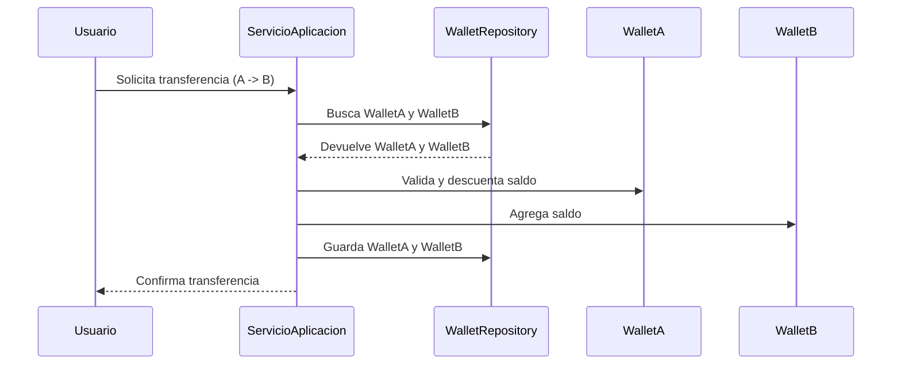

# Servicios de Aplicación

Los servicios de aplicación son responsables de orquestar los casos de uso del dominio, coordinando entidades, servicios de dominio y repositorios. No contienen lógica de negocio compleja, sino que gestionan flujos, validaciones y preocupaciones técnicas como transacciones y seguridad.

---

## Problema Real: Gestión de Wallets en una Plataforma Financiera

En una plataforma financiera, los usuarios pueden tener varias billeteras (wallets) en diferentes monedas. Los servicios de aplicación deben permitir:
- Crear una nueva wallet para un usuario
- Transferir fondos entre wallets (respetando reglas de negocio)
- Recargar saldo en una wallet

El servicio de aplicación debe validar que:
- El usuario pertenece a la organización
- No se transfiera más dinero del disponible
- Las wallets involucradas estén activas y sean de la misma organización

---

## Cómo Leer el Diagrama

El siguiente diagrama muestra el flujo de una transferencia de fondos entre dos wallets:
- Cada "participant" representa un actor o componente del sistema.
- Las flechas (->>) indican el sentido de la comunicación o acción.
- El flujo sigue el orden de arriba hacia abajo, mostrando cómo se solicita, valida y confirma la transferencia.

## Diagrama de Flujo del Caso de Uso



---

## Implementación en Python

```python
from uuid import UUID, uuid4
from decimal import Decimal
from typing import Dict
from pydantic import BaseModel

# DTOs
class CreateWalletDTO(BaseModel):
    user_id: UUID
    organization_id: UUID

class TransferFundsDTO(BaseModel):
    from_wallet_id: UUID
    to_wallet_id: UUID
    amount: Decimal
    currency_code: str

class TopUpDTO(BaseModel):
    wallet_id: UUID
    amount: Decimal
    currency_code: str

# Entidad y repositorio simplificados
class Wallet:
    def __init__(self, id, user_id, organization_id, status='ACTIVE'):
        self.id = id
        self.user_id = user_id
        self.organization_id = organization_id
        self.status = status
        self.balances: Dict[str, Decimal] = {}

    def add_balance(self, currency_code, amount):
        self.balances[currency_code] = self.balances.get(currency_code, Decimal('0')) + amount

    def deduct_balance(self, currency_code, amount):
        if self.balances.get(currency_code, Decimal('0')) < amount:
            raise ValueError('Saldo insuficiente')
        self.balances[currency_code] -= amount

class WalletRepository:
    def __init__(self):
        self.wallets = {}
    def save(self, wallet):
        self.wallets[wallet.id] = wallet
    def find_by_id(self, wallet_id):
        return self.wallets.get(wallet_id)

# Servicio de aplicación
class WalletApplicationService:
    def __init__(self, wallet_repository):
        self.wallet_repository = wallet_repository

    def create_wallet(self, dto: CreateWalletDTO):
        wallet = Wallet(
            id=uuid4(),
            user_id=dto.user_id,
            organization_id=dto.organization_id
        )
        self.wallet_repository.save(wallet)
        return wallet

    def transfer_funds(self, dto: TransferFundsDTO):
        from_wallet = self.wallet_repository.find_by_id(dto.from_wallet_id)
        to_wallet = self.wallet_repository.find_by_id(dto.to_wallet_id)
        if not from_wallet or not to_wallet:
            raise ValueError('Wallet no encontrada')
        if from_wallet.status != 'ACTIVE' or to_wallet.status != 'ACTIVE':
            raise ValueError('Ambas wallets deben estar ACTIVAS')
        if from_wallet.organization_id != to_wallet.organization_id:
            raise ValueError('Las wallets deben ser de la misma organización')
        from_wallet.deduct_balance(dto.currency_code, dto.amount)
        to_wallet.add_balance(dto.currency_code, dto.amount)
        self.wallet_repository.save(from_wallet)
        self.wallet_repository.save(to_wallet)

    def top_up_wallet(self, dto: TopUpDTO):
        wallet = self.wallet_repository.find_by_id(dto.wallet_id)
        if not wallet:
            raise ValueError('Wallet no encontrada')
        wallet.add_balance(dto.currency_code, dto.amount)
        self.wallet_repository.save(wallet)
```

---

## Implementación en TypeScript

```typescript
import { v4 as uuidv4 } from 'uuid';

// DTOs
export interface CreateWalletDTO {
  userId: string;
  organizationId: string;
}

export interface TransferFundsDTO {
  fromWalletId: string;
  toWalletId: string;
  amount: number;
  currencyCode: string;
}

export interface TopUpDTO {
  walletId: string;
  amount: number;
  currencyCode: string;
}

// Entidad y repositorio simplificados
export class Wallet {
  id: string;
  userId: string;
  organizationId: string;
  status: 'ACTIVE' | 'FROZEN' | 'CLOSED';
  balances: Record<string, number>;

  constructor(id: string, userId: string, organizationId: string, status: 'ACTIVE' = 'ACTIVE') {
    this.id = id;
    this.userId = userId;
    this.organizationId = organizationId;
    this.status = status;
    this.balances = {};
  }

  addBalance(currencyCode: string, amount: number) {
    this.balances[currencyCode] = (this.balances[currencyCode] || 0) + amount;
  }

  deductBalance(currencyCode: string, amount: number) {
    if ((this.balances[currencyCode] || 0) < amount) {
      throw new Error('Saldo insuficiente');
    }
    this.balances[currencyCode] -= amount;
  }
}

export class WalletRepository {
  private wallets: Record<string, Wallet> = {};
  save(wallet: Wallet) {
    this.wallets[wallet.id] = wallet;
  }
  findById(walletId: string): Wallet | undefined {
    return this.wallets[walletId];
  }
}

// Servicio de aplicación
export class WalletApplicationService {
  constructor(private walletRepository: WalletRepository) {}

  createWallet(dto: CreateWalletDTO): Wallet {
    const wallet = new Wallet(uuidv4(), dto.userId, dto.organizationId);
    this.walletRepository.save(wallet);
    return wallet;
  }

  transferFunds(dto: TransferFundsDTO): void {
    const fromWallet = this.walletRepository.findById(dto.fromWalletId);
    const toWallet = this.walletRepository.findById(dto.toWalletId);
    if (!fromWallet || !toWallet) {
      throw new Error('Wallet no encontrada');
    }
    if (fromWallet.status !== 'ACTIVE' || toWallet.status !== 'ACTIVE') {
      throw new Error('Ambas wallets deben estar ACTIVAS');
    }
    if (fromWallet.organizationId !== toWallet.organizationId) {
      throw new Error('Las wallets deben ser de la misma organización');
    }
    fromWallet.deductBalance(dto.currencyCode, dto.amount);
    toWallet.addBalance(dto.currencyCode, dto.amount);
    this.walletRepository.save(fromWallet);
    this.walletRepository.save(toWallet);
  }

  topUpWallet(dto: TopUpDTO): void {
    const wallet = this.walletRepository.findById(dto.walletId);
    if (!wallet) {
      throw new Error('Wallet no encontrada');
    }
    wallet.addBalance(dto.currencyCode, dto.amount);
    this.walletRepository.save(wallet);
  }
}
```

---

## Resumen

- Los servicios de aplicación orquestan los casos de uso del dominio, validando y coordinando entidades y servicios de dominio.
- El ejemplo de wallets muestra cómo implementar un caso de uso realista y relevante, tanto en Python como en TypeScript.
- Mantén los servicios de aplicación delgados, enfocados en la orquestación y separados de la lógica de negocio pura. 