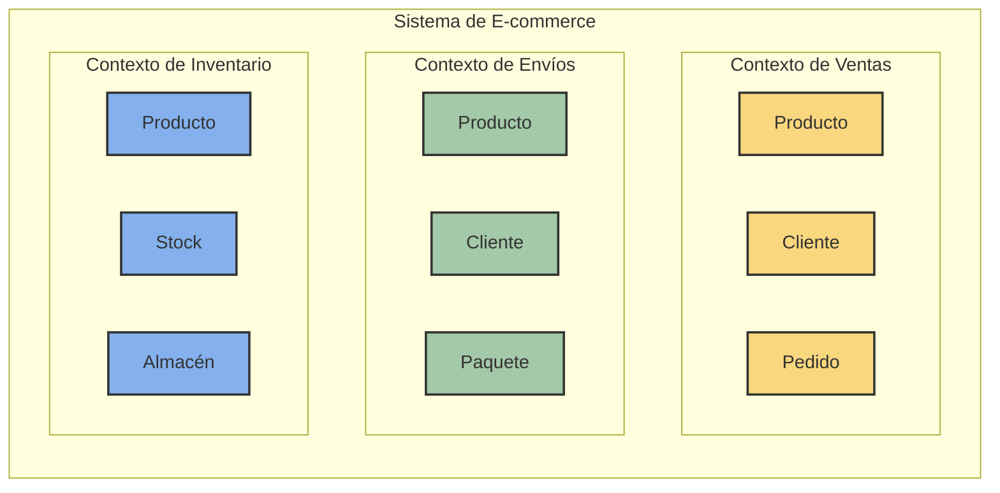
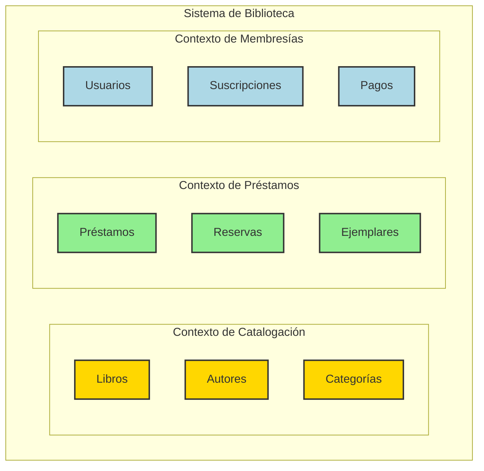
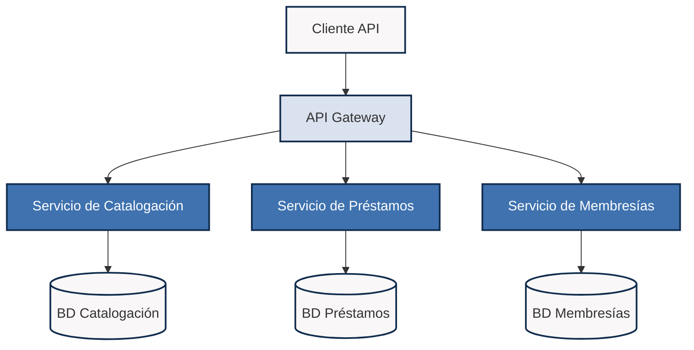
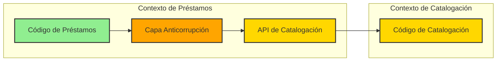
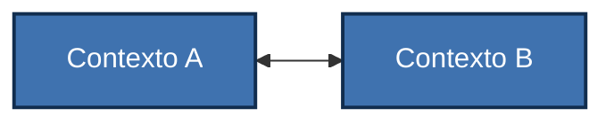
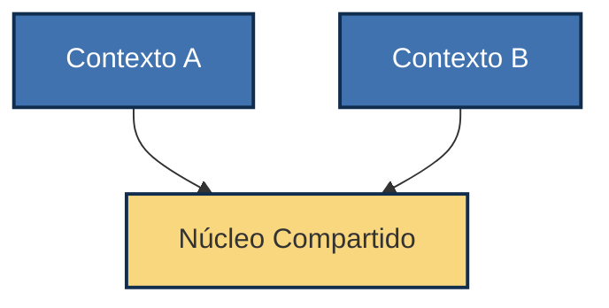
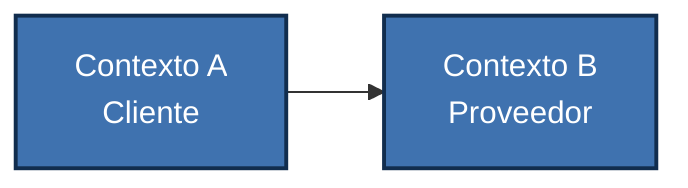
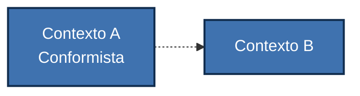
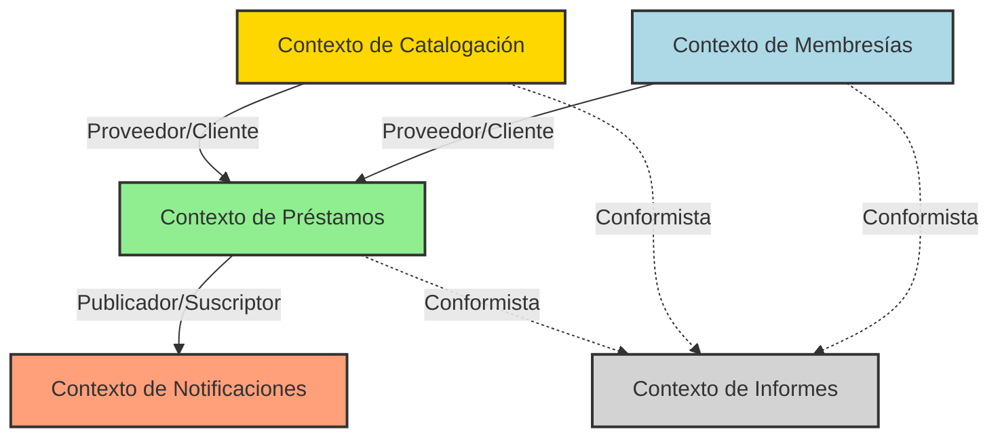
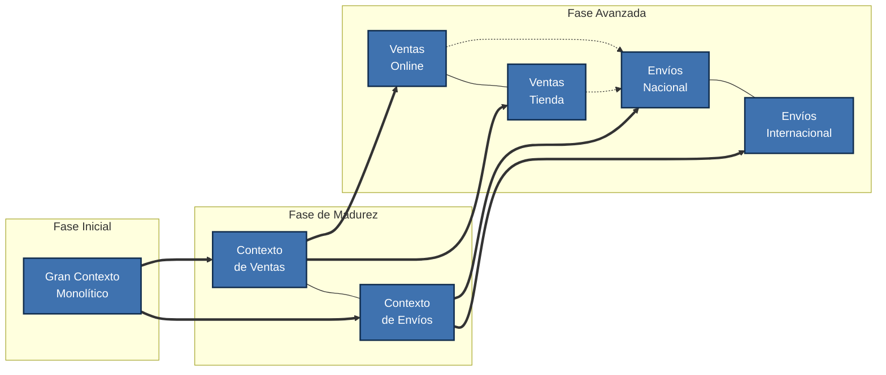

# Contextos Delimitados

Los Contextos Delimitados (Bounded Contexts) son un concepto central en el Diseño Dirigido por el Dominio (DDD) que ayuda a manejar la complejidad en modelos de dominio grandes dividiendo el dominio en múltiples modelos conceptuales con límites explícitos.

## ¿Qué es un Contexto Delimitado?

Un Contexto Delimitado es simplemente un límite claro alrededor de un modelo específico. Es como dividir un sistema grande en subsistemas más pequeños y manejables, donde:

- Cada subsistema tiene su propio vocabulario (términos y conceptos)
- Las palabras tienen un significado preciso y consistente dentro de ese límite
- El modelo está adaptado a un aspecto particular del negocio

### Visualización de Contextos Delimitados



En cada contexto, algunos términos tienen significados diferentes:

| Término    | En Ventas                       | En Envíos                      | En Inventario                   |
|------------|--------------------------------|--------------------------------|--------------------------------|
| **Producto** | Algo que se vende con precio   | Algo con peso y dimensiones    | Algo con ubicación y stock      |
| **Cliente**  | Alguien que compra y paga      | Alguien que recibe un paquete  | No es relevante                 |
| **Pedido**   | Conjunto de productos comprados| Paquete a entregar en dirección| Razón para reducir inventario   |

## ¿Por qué necesitamos Contextos Delimitados?

Los Contextos Delimitados resuelven problemas comunes:

1. **Evitan confusión**: Cuando "cliente" significa cosas diferentes para ventas y envíos
2. **Reducen complejidad**: Dividiendo el problema en partes más pequeñas
3. **Permiten trabajo en paralelo**: Diferentes equipos pueden trabajar en diferentes contextos
4. **Facilitan cambios**: Los cambios en un contexto tienen impacto limitado en otros

## Identificando Contextos Delimitados

Para identificar contextos en tu sistema, busca:

1. **Diferentes vocabularios**: Cuando los mismos términos significan cosas distintas
2. **Grupos naturales de funcionalidad**: Partes del sistema que funcionan juntas
3. **Responsabilidades organizacionales**: Áreas gestionadas por diferentes equipos
4. **Sistemas existentes**: Aplicaciones independientes que ya funcionan separadamente

### Ejemplo Práctico: Sistema de Biblioteca



## Implementación de Contextos Delimitados

Hay varias formas de implementar contextos delimitados, dependiendo del tamaño y la complejidad del sistema.

### 1. Separación en Módulos o Paquetes

La forma más simple de implementar Contextos Delimitados es usando módulos o paquetes:

```python
# Contexto de Catalogación
class catalogacion:
    class Libro:
        def __init__(self, id, titulo, autor, isbn):
            self.id = id
            self.titulo = titulo
            self.autor = autor
            self.isbn = isbn

# Contexto de Préstamos
class prestamos:
    class Ejemplar:
        def __init__(self, id, libro_id, estado):
            self.id = id
            self.libro_id = libro_id  # Referencia al otro contexto
            self.estado = estado
            
    class Prestamo:
        def __init__(self, id, ejemplar_id, usuario_id, fecha_vencimiento):
            self.id = id
            self.ejemplar_id = ejemplar_id
            self.usuario_id = usuario_id
            self.fecha_vencimiento = fecha_vencimiento

# Contexto de Membresías
class membresias:
    class Usuario:
        def __init__(self, id, nombre, email, tipo_membresia):
            self.id = id
            self.nombre = nombre
            self.email = email
            self.tipo_membresia = tipo_membresia
```

### 2. Separación en Directorios

Una estructura de proyecto típica para Contextos Delimitados:

```
biblioteca/
├── catalogacion/
│   ├── dominio/
│   │   ├── libro.py
│   │   ├── autor.py
│   │   └── categoria.py
│   ├── aplicacion/
│   │   └── servicios.py
│   └── infraestructura/
│       └── repositorios.py
│
├── prestamos/
│   ├── dominio/
│   │   ├── ejemplar.py
│   │   ├── prestamo.py
│   │   └── reserva.py
│   ├── aplicacion/
│   │   └── servicios.py
│   └── infraestructura/
│       └── repositorios.py
│
└── membresias/
    ├── dominio/
    │   ├── usuario.py
    │   └── suscripcion.py
    ├── aplicacion/
    │   └── servicios.py
    └── infraestructura/
        └── repositorios.py
```

### 3. Separación en Servicios (Microservicios)

Para sistemas más grandes, cada Contexto Delimitado podría ser un servicio independiente:



## Comunicación Entre Contextos Delimitados

Los Contextos Delimitados necesitan comunicarse entre sí. Hay varias formas de hacerlo:

### 1. Integración Directa (Más Simple)

El contexto de Préstamos usa directamente código del contexto de Catalogación:

```python
# En el contexto de Préstamos
from catalogacion.dominio.libro import Libro

def procesar_prestamo(ejemplar_id, usuario_id):
    ejemplar = repositorio_ejemplares.obtener_por_id(ejemplar_id)
    libro = repositorio_libros.obtener_por_id(ejemplar.libro_id)
    
    if ejemplar.esta_disponible() and not libro.es_referencia_solo():
        # Lógica para procesar préstamo
```

### 2. Integración Mediante Eventos (Más Desacoplada)

```mermaid
sequenceDiagram
    participant C as Contexto de Catalogación
    participant EB as Event Bus
    participant P as Contexto de Préstamos
    
    C->>EB: Publica evento "LibroActualizado"
    EB->>P: Entrega evento "LibroActualizado"
    Note over P: Maneja el evento y actualiza<br>el estado de los ejemplares
    
    style C fill:#FFD700,stroke:#333,stroke-width:2px
    style EB fill:#DDDDDD,stroke:#333,stroke-width:2px
    style P fill:#90EE90,stroke:#333,stroke-width:2px
```

Código de ejemplo:

```python
# Publicado desde el contexto de Catalogación
class LibroActualizado:
    def __init__(self, libro_id, nuevo_titulo, nuevo_estado):
        self.libro_id = libro_id
        self.nuevo_titulo = nuevo_titulo
        self.nuevo_estado = nuevo_estado

# Consumido en el contexto de Préstamos
class ManejadorLibroActualizado:
    def __init__(self, repositorio_ejemplares):
        self.repositorio_ejemplares = repositorio_ejemplares
    
    def manejar(self, evento):
        # Si el libro pasó a estado "Fuera de Circulación"
        if evento.nuevo_estado == "FUERA_DE_CIRCULACION":
            # Cancelar todas las reservas pendientes para este libro
            ejemplares = self.repositorio_ejemplares.buscar_por_libro_id(evento.libro_id)
            for ejemplar in ejemplares:
                ejemplar.marcar_fuera_de_circulacion()
            # Lógica adicional...
```

### 3. Capa Anticorrupción

Cuando un contexto necesita protegerse de cambios en otro, usa una "capa anticorrupción":



Código de ejemplo:

```python
# En el contexto de Préstamos
class AdaptadorCatalogacion:
    """Capa anticorrupción que traduce entre contextos"""
    
    def __init__(self, cliente_api_catalogacion):
        self.cliente = cliente_api_catalogacion
    
    def obtener_info_libro(self, libro_id):
        # Llamada al otro contexto
        datos_libro = self.cliente.obtener_libro(libro_id)
        
        # Traducción al modelo que necesita Préstamos
        return {
            "id": datos_libro["id"],
            "titulo": datos_libro["titulo"],
            "es_prestable": datos_libro["tipo"] != "REFERENCIA",
            "dias_prestamo": self._calcular_dias_prestamo(datos_libro["categoria"])
        }
    
    def _calcular_dias_prestamo(self, categoria):
        # Mapeo entre categorías de Catalogación y días de préstamo
        mapeo_dias = {
            "FICCION": 21,
            "NO_FICCION": 14,
            "REVISTA": 7,
            "NUEVO": 10
        }
        return mapeo_dias.get(categoria, 14)  # 14 días por defecto
```

## Patrones de Relación Entre Contextos

Existen diferentes tipos de relaciones entre contextos:

### 1. Asociación (Partnership)



Dos equipos colaboran estrechamente, coordinando cambios.

**Ejemplo**: El equipo de Préstamos y el equipo de Membresías colaboran para implementar la funcionalidad de préstamo.

### 2. Núcleo Compartido (Shared Kernel)



Parte del modelo se comparte y mantiene conjuntamente.

**Ejemplo**: Préstamos y Catalogación comparten definiciones comunes de categorías de libros y estados.

### 3. Cliente-Proveedor (Customer-Supplier)



Un contexto depende de los servicios proporcionados por otro.

**Ejemplo**: El contexto de Préstamos (cliente) depende de información del contexto de Catalogación (proveedor).

### 4. Conformista (Conformist)



Un contexto se adapta al modelo de otro sin poder influir en él.

**Ejemplo**: Un sistema de informes debe adaptarse al modelo de datos del sistema de Préstamos sin poder modificarlo.

## Mapa de Contexto

Una herramienta fundamental en DDD es el "Mapa de Contexto" - un diagrama que muestra todos los contextos delimitados y sus relaciones:



## Ejemplo Práctico Completo

Veamos cómo interactúan los contextos en nuestro sistema de biblioteca:

### Cuando un usuario toma prestado un libro:

```python
# Servicio de Aplicación en el contexto de Préstamos
class ServicioPrestamos:
    def __init__(
        self, 
        repositorio_ejemplares,
        repositorio_prestamos, 
        adaptador_membresias,  # Para verificar el usuario
        adaptador_catalogacion  # Para verificar el libro
    ):
        self.repositorio_ejemplares = repositorio_ejemplares
        self.repositorio_prestamos = repositorio_prestamos
        self.adaptador_membresias = adaptador_membresias
        self.adaptador_catalogacion = adaptador_catalogacion
    
    def realizar_prestamo(self, ejemplar_id, usuario_id):
        # 1. Consultar al Contexto de Membresías si el usuario puede pedir prestado
        info_usuario = self.adaptador_membresias.verificar_usuario(usuario_id)
        if not info_usuario["puede_pedir_prestado"]:
            raise ValueError(f"El usuario {usuario_id} no puede pedir prestado")
            
        # 2. Verificar si el ejemplar está disponible
        ejemplar = self.repositorio_ejemplares.obtener_por_id(ejemplar_id)
        if not ejemplar or not ejemplar.esta_disponible():
            raise ValueError(f"El ejemplar {ejemplar_id} no está disponible")
            
        # 3. Consultar al Contexto de Catalogación sobre restricciones del libro
        info_libro = self.adaptador_catalogacion.obtener_info_libro(ejemplar.libro_id)
        if not info_libro["es_prestable"]:
            raise ValueError(f"El libro {ejemplar.libro_id} no es prestable")
            
        # 4. Crear el préstamo con la duración indicada por Catalogación
        prestamo_id = f"P{datetime.now().strftime('%Y%m%d%H%M%S')}"
        dias_prestamo = info_libro["dias_prestamo"]
        
        prestamo = Prestamo(
            id=prestamo_id,
            ejemplar_id=ejemplar_id,
            usuario_id=usuario_id,
            fecha_prestamo=datetime.now(),
            dias=dias_prestamo
        )
        
        # 5. Actualizar el estado del ejemplar
        ejemplar.prestar(prestamo_id)
        
        # 6. Persistir los cambios
        self.repositorio_ejemplares.guardar(ejemplar)
        self.repositorio_prestamos.guardar(prestamo)
        
        # 7. Publicar evento para que otros contextos puedan reaccionar
        self.publicador_eventos.publicar(
            PrestamoCreado(
                prestamo_id=prestamo.id,
                usuario_id=usuario_id,
                ejemplar_id=ejemplar_id,
                libro_id=ejemplar.libro_id,
                fecha_vencimiento=prestamo.fecha_vencimiento
            )
        )
        
        return prestamo
```

### Reacción a eventos entre contextos:

```python
# En el contexto de Membresías, escuchando eventos de Préstamos
class ManejadorPrestamoCreado:
    def __init__(self, repositorio_usuarios):
        self.repositorio_usuarios = repositorio_usuarios
    
    def manejar(self, evento):
        # Actualizar contador de préstamos activos del usuario
        usuario = self.repositorio_usuarios.obtener_por_id(evento.usuario_id)
        if usuario:
            usuario.incrementar_prestamos_activos()
            self.repositorio_usuarios.guardar(usuario)
```

## Evolución de Contextos Delimitados

Es importante entender que los contextos delimitados evolucionan con el tiempo:



## Consejos Prácticos para Equipos Nuevos en DDD

### 1. Empieza con Contextos Grandes

Si eres nuevo en DDD, comienza con pocos contextos grandes y ve refinándolos:

### 2. Identifica Términos Ambiguos

Busca términos que causan confusión en las conversaciones del equipo:

"Necesitamos actualizar el **cliente**."
- ¿Te refieres al usuario de la aplicación?
- ¿O al programa cliente que se conecta al servidor?
- ¿O al cliente como empresa que nos contrata?

Estos términos ambiguos a menudo señalan la necesidad de contextos separados.

### 3. Documenta tus Contextos Visualmente

Usa diagramas simples para documentar tus contextos y sus relaciones.

## Conclusión

Los Contextos Delimitados son una herramienta poderosa para dividir sistemas complejos en partes manejables. Recuerda:

1. Comienza con pocos contextos y refinánlos con el tiempo
2. Define claramente el significado de los términos en cada contexto
3. Establece cómo se comunican los contextos entre sí
4. Documenta visualmente las relaciones entre contextos

No existe una única forma "correcta" de dividir un sistema en contextos. Lo importante es que la división tenga sentido para tu equipo y para el negocio. 