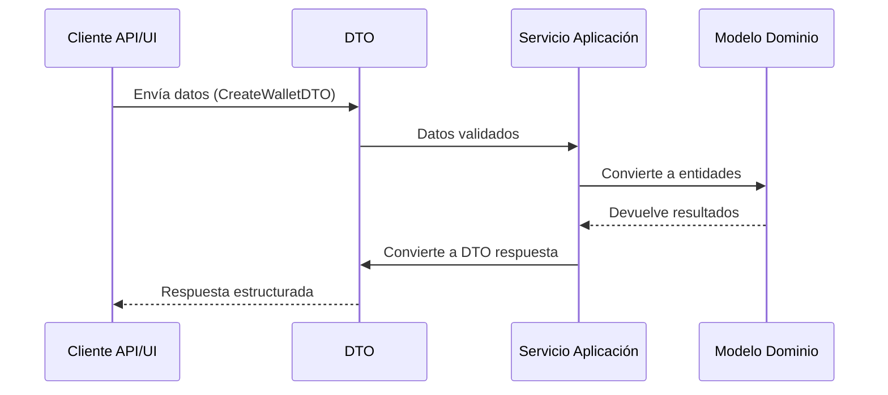

# Data Transfer Objects (DTOs)

Los Data Transfer Objects (DTOs) son objetos simples utilizados para transferir datos entre subsistemas o capas de una aplicación. En DDD, actúan como intermediarios entre el dominio y las interfaces externas, protegiendo la integridad del modelo de dominio.

---

## Propósito de los DTOs

Los DTOs resuelven varios problemas específicos:

1. **Aislamiento del dominio**: Protegen las entidades y agregados de exposición directa al exterior.
2. **Optimización de transferencias**: Permiten transferir solo los datos necesarios para cada operación.
3. **Evolución independiente**: Facilitan que el modelo de dominio interno evolucione sin afectar a clientes externos.
4. **Control de visibilidad**: Ayudan a ocultar datos sensibles o innecesarios para operaciones específicas.

---

## Características clave de los DTOs

- **Simples contenedores de datos**: Contienen principalmente propiedades, sin lógica de negocio compleja.
- **Inmutables**: Idealmente son inmutables una vez creados para evitar efectos secundarios.
- **Independientes del dominio**: No dependen de las entidades o reglas de dominio.
- **Formato adecuado para la interfaz**: Se ajustan a las necesidades de la interfaz externa (API, UI).
- **Claramente definidos**: Tienen una estructura explícita y validación básica.

---

## Cómo Leer el Diagrama

El siguiente diagrama muestra el flujo de datos usando DTOs:
- Los DTOs actúan como traductores entre la API externa y el modelo de dominio.
- El servicio de aplicación es responsable de convertir entre DTOs y entidades de dominio.
- El dominio (entidades, agregados, servicios de dominio) nunca trabaja directamente con DTOs.

## Diagrama de Flujo



---

## Implementación en Python

```python
from pydantic import BaseModel, validator
from uuid import UUID
from decimal import Decimal
from datetime import datetime
from typing import Optional, List

# DTOs para la operación de Wallet

class CreateWalletDTO(BaseModel):
    """DTO para la creación de una nueva wallet"""
    user_id: UUID
    organization_id: UUID
    
    @validator('user_id', 'organization_id')
    def ids_must_be_valid(cls, v):
        if v is None:
            raise ValueError('ID no puede ser nulo')
        return v

class WalletResponseDTO(BaseModel):
    """DTO para la respuesta de operaciones con wallet"""
    id: UUID
    user_id: UUID
    organization_id: UUID
    status: str
    created_at: datetime
    balances: dict[str, Decimal] = {}

class TransferFundsDTO(BaseModel):
    """DTO para la transferencia de fondos entre wallets"""
    from_wallet_id: UUID
    to_wallet_id: UUID
    amount: Decimal
    currency_code: str
    
    @validator('amount')
    def amount_must_be_positive(cls, v):
        if v <= 0:
            raise ValueError('El monto debe ser positivo')
        return v

class TransactionResponseDTO(BaseModel):
    """DTO para la respuesta de una transacción"""
    transaction_id: UUID
    status: str
    timestamp: datetime
    amount: Decimal
    currency_code: str
    from_wallet_id: UUID
    to_wallet_id: UUID
```

---

## Implementación en TypeScript

```typescript
import { IsUUID, IsNotEmpty, IsPositive, IsString, IsDate } from 'class-validator';

// DTOs para la operación de Wallet

export class CreateWalletDTO {
  @IsUUID()
  @IsNotEmpty()
  userId: string;

  @IsUUID()
  @IsNotEmpty()
  organizationId: string;
}

export class WalletResponseDTO {
  @IsUUID()
  id: string;

  @IsUUID()
  userId: string;

  @IsUUID()
  organizationId: string;

  @IsString()
  status: string;

  @IsDate()
  createdAt: Date;

  balances: Record<string, number> = {};
}

export class TransferFundsDTO {
  @IsUUID()
  fromWalletId: string;

  @IsUUID()
  toWalletId: string;

  @IsPositive()
  amount: number;

  @IsString()
  @IsNotEmpty()
  currencyCode: string;
}

export class TransactionResponseDTO {
  @IsUUID()
  transactionId: string;

  @IsString()
  status: string;

  @IsDate()
  timestamp: Date;

  @IsPositive()
  amount: number;

  @IsString()
  currencyCode: string;

  @IsUUID()
  fromWalletId: string;

  @IsUUID()
  toWalletId: string;
}
```

---

## DTOs vs Entidades/Objetos de Valor

| Aspecto | DTOs | Entidades/Objetos de Valor |
|---------|------|----------------------------|
| **Propósito** | Transferencia de datos | Modelado del dominio |
| **Comportamiento** | Mínimo o nulo | Encapsulan comportamiento y reglas |
| **Ubicación** | Entre interfaces y aplicación | Dentro del dominio |
| **Validación** | Básica (formato, tipos) | Reglas de negocio complejas |
| **Mutabilidad** | Preferiblemente inmutables | Según necesidades del dominio |
| **Visibilidad** | Expuestos a interfaces externas | Encapsulados en el dominio |

---

## Buenas Prácticas

1. **Nombrado claro**: Usa el sufijo "DTO" para distinguirlos de entidades de dominio.
2. **Validación apropiada**: Incluye validaciones básicas de datos pero no reglas de negocio.
3. **Inmutabilidad**: Diseña DTOs inmutables cuando sea posible.
4. **Específicos por caso de uso**: Crea DTOs específicos para cada operación en lugar de DTOs genéricos.
5. **Evita la herencia profunda**: Prefiere composición sobre herencia en DTOs.
6. **Documentación**: Documenta claramente el propósito y uso de cada DTO.

---

## Preguntas Frecuentes

### ¿Los servicios de dominio deberían usar DTOs?
No, los servicios de dominio deben trabajar exclusivamente con entidades y objetos de valor del dominio. La traducción entre DTOs y objetos de dominio es responsabilidad de los servicios de aplicación.

### ¿Puedo utilizar una entidad directamente como respuesta de una API?
Técnicamente es posible, pero no es recomendable porque:
- Expone detalles internos del dominio
- Dificulta la evolución independiente del modelo de dominio
- Puede filtrar información sensible
- No permite optimizar la transferencia de datos

### ¿Debería crear un DTO por cada entidad?
No necesariamente. Los DTOs deben diseñarse por caso de uso, no por entidad. Un DTO puede combinar datos de múltiples entidades o representar solo una parte de una entidad, según lo que requiera la interfaz externa.

---

## Resumen

- Los DTOs son contenedores simples para transferir datos entre la capa de dominio y las interfaces externas.
- Ayudan a proteger el modelo de dominio, optimizar las transferencias de datos y evolucionar independientemente.
- Deben ser utilizados principalmente por servicios de aplicación, no por componentes del dominio.
- Se deben diseñar específicamente para cada caso de uso, con validaciones básicas pero sin lógica de negocio compleja. 