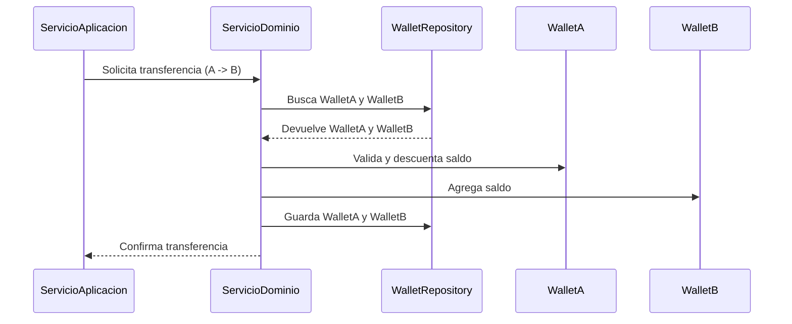

# Servicios de Dominio

Los servicios de dominio encapsulan la lógica de negocio que no pertenece naturalmente a entidades o objetos de valor específicos. Son ideales para operaciones que involucran múltiples entidades o agregados, como la transferencia de fondos entre wallets.

---

## Problema Real: Transferencia de Fondos entre Wallets

En una plataforma financiera, los usuarios pueden transferir fondos entre sus billeteras (wallets) en diferentes monedas. La transferencia debe cumplir reglas de negocio como:
- Ambas wallets deben estar activas
- Deben pertenecer a la misma organización
- No se puede transferir más dinero del disponible

El servicio de dominio se encarga de orquestar y validar estas reglas, manteniendo la lógica de negocio pura y reutilizable.

---

## Cómo Leer el Diagrama

El siguiente diagrama muestra el flujo de una transferencia de fondos:
- Cada "participant" representa un actor o componente del sistema.
- Las flechas (->>) indican el sentido de la comunicación o acción.
- El flujo sigue el orden de arriba hacia abajo, mostrando cómo se valida y ejecuta la transferencia.

## Diagrama de Flujo del Caso de Uso



---

## Implementación en Python

```python
from uuid import UUID
from decimal import Decimal
from typing import Dict

class Wallet:
    def __init__(self, id, organization_id, status='ACTIVE'):
        self.id = id
        self.organization_id = organization_id
        self.status = status
        self.balances: Dict[str, Decimal] = {}

    def add_balance(self, currency_code, amount):
        self.balances[currency_code] = self.balances.get(currency_code, Decimal('0')) + amount

    def deduct_balance(self, currency_code, amount):
        if self.balances.get(currency_code, Decimal('0')) < amount:
            raise ValueError('Saldo insuficiente')
        self.balances[currency_code] -= amount

class WalletRepository:
    def __init__(self):
        self.wallets = {}
    def save(self, wallet):
        self.wallets[wallet.id] = wallet
    def find_by_id(self, wallet_id):
        return self.wallets.get(wallet_id)

class TransferFundsService:
    def __init__(self, wallet_repository: WalletRepository):
        self.wallet_repository = wallet_repository

    def transfer(self, from_wallet_id: UUID, to_wallet_id: UUID, amount: Decimal, currency_code: str):
        from_wallet = self.wallet_repository.find_by_id(from_wallet_id)
        to_wallet = self.wallet_repository.find_by_id(to_wallet_id)
        if not from_wallet or not to_wallet:
            raise ValueError('Wallet no encontrada')
        if from_wallet.status != 'ACTIVE' or to_wallet.status != 'ACTIVE':
            raise ValueError('Ambas wallets deben estar ACTIVAS')
        if from_wallet.organization_id != to_wallet.organization_id:
            raise ValueError('Las wallets deben ser de la misma organización')
        from_wallet.deduct_balance(currency_code, amount)
        to_wallet.add_balance(currency_code, amount)
        self.wallet_repository.save(from_wallet)
        self.wallet_repository.save(to_wallet)
```

---

## Implementación en TypeScript

```typescript
// Entidad y repositorio simplificados
export class Wallet {
  id: string;
  organizationId: string;
  status: 'ACTIVE' | 'FROZEN' | 'CLOSED';
  balances: Record<string, number>;

  constructor(id: string, organizationId: string, status: 'ACTIVE' = 'ACTIVE') {
    this.id = id;
    this.organizationId = organizationId;
    this.status = status;
    this.balances = {};
  }

  addBalance(currencyCode: string, amount: number) {
    this.balances[currencyCode] = (this.balances[currencyCode] || 0) + amount;
  }

  deductBalance(currencyCode: string, amount: number) {
    if ((this.balances[currencyCode] || 0) < amount) {
      throw new Error('Saldo insuficiente');
    }
    this.balances[currencyCode] -= amount;
  }
}

export class WalletRepository {
  private wallets: Record<string, Wallet> = {};
  save(wallet: Wallet) {
    this.wallets[wallet.id] = wallet;
  }
  findById(walletId: string): Wallet | undefined {
    return this.wallets[walletId];
  }
}

// Servicio de dominio
export class TransferFundsService {
  constructor(private walletRepository: WalletRepository) {}

  transfer(fromWalletId: string, toWalletId: string, amount: number, currencyCode: string): void {
    const fromWallet = this.walletRepository.findById(fromWalletId);
    const toWallet = this.walletRepository.findById(toWalletId);
    if (!fromWallet || !toWallet) {
      throw new Error('Wallet no encontrada');
    }
    if (fromWallet.status !== 'ACTIVE' || toWallet.status !== 'ACTIVE') {
      throw new Error('Ambas wallets deben estar ACTIVAS');
    }
    if (fromWallet.organizationId !== toWallet.organizationId) {
      throw new Error('Las wallets deben ser de la misma organización');
    }
    fromWallet.deductBalance(currencyCode, amount);
    toWallet.addBalance(currencyCode, amount);
    this.walletRepository.save(fromWallet);
    this.walletRepository.save(toWallet);
  }
}
```

---

## Servicios de Dominio vs. Lógica en Entidades

En DDD, siempre buscamos ubicar la lógica de negocio en el lugar más adecuado. La regla general es:

1. **Lógica en entidades/agregados**: Cuando la operación involucra a una sola entidad o agregado
2. **Lógica en servicios de dominio**: Cuando la operación:
   - Involucra múltiples agregados
   - No es responsabilidad natural de un agregado específico
   - Representa una operación o algoritmo complejo del dominio

---

## Tipos de Servicios de Dominio

Existen varios tipos de servicios de dominio según su propósito:

1. **Servicios de operación**: Realizan operaciones sobre múltiples agregados (ej: transferencia de fondos)
2. **Servicios de cálculo**: Implementan algoritmos complejos (ej: cálculo de rutas de envío)
3. **Servicios de validación**: Verifican reglas de negocio complejas (ej: criterios de elegibilidad)
4. **Servicios de transformación**: Convierten datos de un formato a otro dentro del dominio

---

## Preguntas Frecuentes

### ¿Cómo decido si la lógica debe ir en una entidad o en un servicio de dominio?
Si la lógica solo afecta a una entidad y sus objetos internos, debe ir en la entidad. Si involucra coordinar o validar múltiples agregados, o representa un proceso de negocio complejo, probablemente debería ir en un servicio de dominio.

### ¿Los servicios de dominio pueden llamar a repositorios?
Sí, es común que los servicios de dominio accedan a repositorios para obtener las entidades o agregados con los que necesitan trabajar. Sin embargo, no deben tener lógica de persistencia directa.

### ¿Puedo tener servicios de dominio que dependen de otros servicios de dominio?
Sí, es posible componer servicios de dominio para operaciones más complejas. Sin embargo, evita crear dependencias circulares y mantén clara la jerarquía de responsabilidades.

### ¿Cuál es la diferencia entre un servicio de dominio y un servicio de infraestructura?
Un servicio de dominio contiene lógica de negocio pura y es independiente de la infraestructura. Un servicio de infraestructura proporciona funcionalidades técnicas como envío de correos, integración con APIs externas, persistencia, etc.

### ¿Los servicios de dominio deben ser stateless (sin estado)?
Sí, los servicios de dominio deben ser stateless. Toda la información necesaria para ejecutar sus operaciones debe pasarse como parámetros, y cualquier estado debe almacenarse en las entidades o agregados.

---

## Resumen

- Los servicios de dominio encapsulan lógica de negocio que involucra múltiples entidades o agregados.
- El ejemplo de transferencia de fondos muestra cómo implementar un caso de uso realista y relevante, tanto en Python como en TypeScript.
- Mantén los servicios de dominio enfocados en la lógica de negocio pura, separados de la infraestructura y fáciles de testear. 