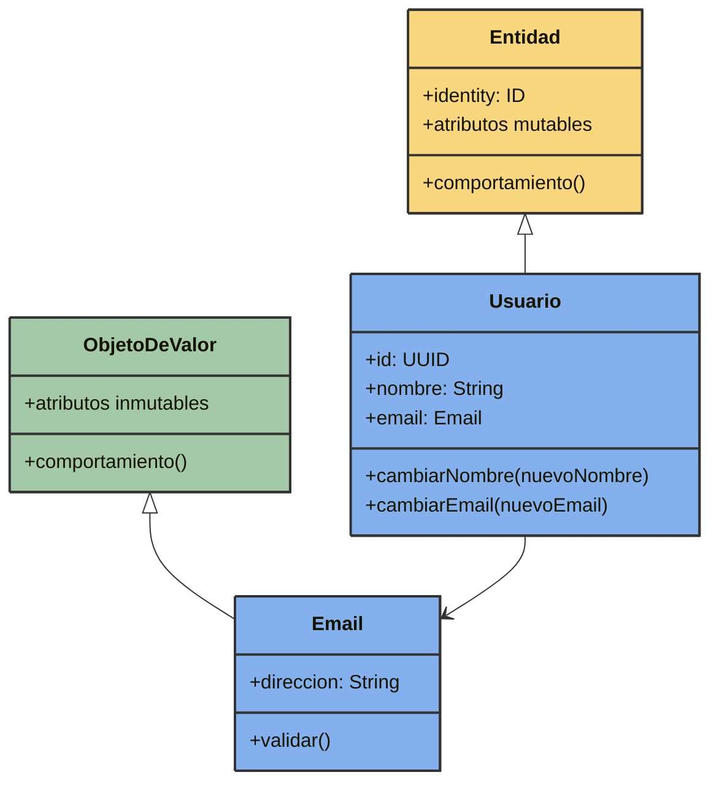
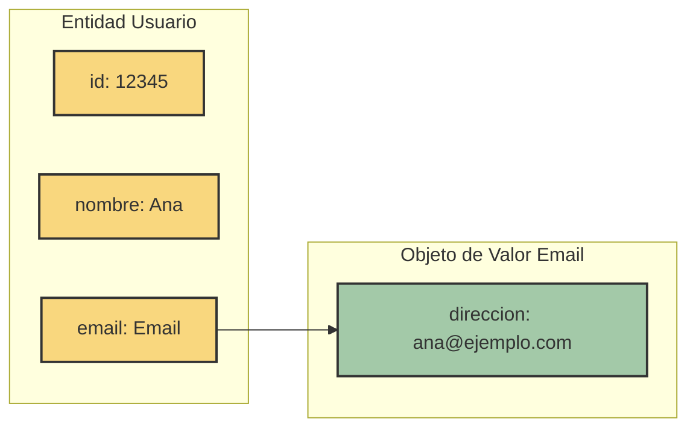
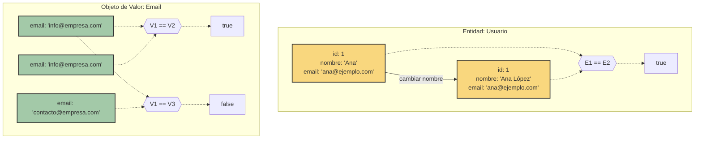
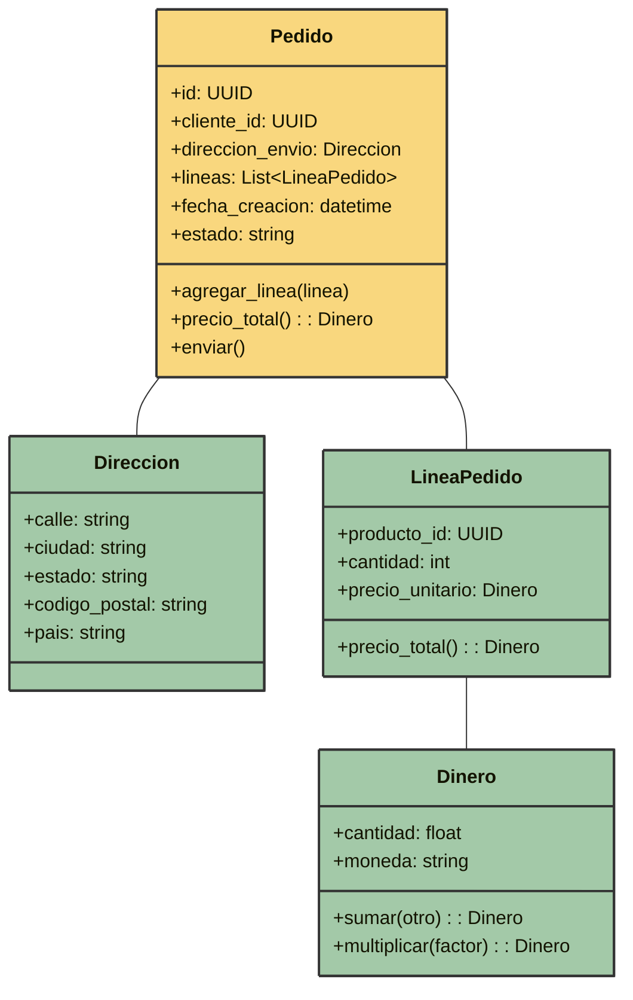

# Entidades y Objetos de Valor

Las Entidades y los Objetos de Valor son los bloques básicos de construcción de un modelo de dominio en el Diseño Dirigido por el Dominio (DDD). Entender la distinción entre estos dos tipos de objetos es fundamental para crear modelos de dominio efectivos.

## Visión General de los Conceptos



## Entidades

Las Entidades son objetos que tienen una identidad única que persiste en el tiempo, independientemente de los cambios en sus atributos.

### Características Principales de las Entidades

- **Identidad**: Una entidad tiene un identificador único que la distingue de todas las demás instancias.
- **Mutabilidad**: Las entidades pueden cambiar sus atributos a lo largo del tiempo manteniendo su identidad.
- **Ciclo de vida**: Las entidades tienen un ciclo de vida - se crean, pueden cambiar y pueden ser archivadas o eliminadas.
- **Igualdad por ID**: Dos entidades con la misma identidad se consideran la misma entidad, incluso si tienen valores de atributos diferentes.

### Ejemplos de Entidades

- Un `Usuario` en un sistema (identificado por ID de usuario)
- Un `Pedido` en un sistema de comercio electrónico (identificado por número de pedido)
- Una `CuentaBancaria` (identificada por número de cuenta)
- Un `Producto` en inventario (identificado por SKU)

### Implementando Entidades en Python

```python
class Usuario:
    def __init__(self, usuario_id, nombre, email):
        self.id = usuario_id  # Campo de identidad
        self.nombre = nombre
        self.email = email
        
    def cambiar_nombre(self, nuevo_nombre):
        self.nombre = nuevo_nombre
        
    def cambiar_email(self, nuevo_email):
        self.email = nuevo_email
        
    def __eq__(self, other):
        if not isinstance(other, Usuario):
            return False
        return self.id == other.id  # Igualdad por ID, no por atributos
        
    def __hash__(self):
        return hash(self.id)  # Hash basado en identidad
```

Observa cómo:
- El campo `id` contiene la identidad de la entidad
- La igualdad (`__eq__`) se basa en la identidad, no en los atributos
- Los métodos permiten cambiar atributos mientras la identidad se mantiene constante

## Objetos de Valor

Los Objetos de Valor son objetos que no tienen una identidad conceptual - se definen únicamente por sus atributos.

### Características Principales de los Objetos de Valor

- **Sin Identidad**: Los objetos de valor no tienen un campo identificador.
- **Inmutabilidad**: Una vez creados, los objetos de valor no deben cambiar (cualquier "cambio" crea una nueva instancia).
- **Igualdad por Atributos**: Dos objetos de valor con los mismos atributos se consideran iguales.
- **Reemplazables**: Los objetos de valor pueden ser reemplazados libremente por otros que tengan los mismos atributos.
- **A menudo se utilizan para medir, cuantificar o describir**: Los objetos de valor suelen representar conceptos como dinero, fechas, direcciones.



### Ejemplos de Objetos de Valor

- Una `DireccionEmail` (definida por su representación de cadena)
- Una cantidad de `Dinero` (definida por cantidad y moneda)
- Un `RangoDeFechas` (definido por fechas de inicio y fin)
- Una `Direccion` (definida por calle, ciudad, código postal, etc.)

### Implementando Objetos de Valor en Python

```python
from dataclasses import dataclass

@dataclass(frozen=True)  # frozen=True lo hace inmutable
class Dinero:
    cantidad: float
    moneda: str
    
    def __post_init__(self):
        # Lógica de validación (en una implementación real, usaríamos
        # un enfoque diferente ya que frozen=True impide cambios de atributos)
        if self.cantidad < 0:
            object.__setattr__(self, "cantidad", 0)
            
    def sumar(self, otro):
        if self.moneda != otro.moneda:
            raise ValueError("No se pueden sumar monedas diferentes")
        # Crear una nueva instancia en lugar de modificar esta
        return Dinero(self.cantidad + otro.cantidad, self.moneda)
        
    def multiplicar(self, factor):
        # De nuevo, crea una nueva instancia
        return Dinero(self.cantidad * factor, self.moneda)
```

Observa cómo:
- Usamos `@dataclass(frozen=True)` para crear un objeto inmutable
- Los métodos `sumar` y `multiplicar` devuelven nuevas instancias en lugar de modificar la existente
- No hay campo de identidad

## Comparación de Comportamiento



## Cuándo Usar Entidades vs. Objetos de Valor

Usa una **Entidad** cuando:
- El objeto necesita ser rastreado a lo largo del tiempo
- El objeto tiene una identidad distinta en el dominio
- El mismo objeto puede cambiar con el tiempo mientras sigue siendo "el mismo"
- Necesitas mantener un historial del objeto

Usa un **Objeto de Valor** cuando:
- El objeto se define enteramente por sus atributos
- La igualdad se determina comparando todos los atributos
- El concepto es inmutable en el dominio
- Reemplazarlo con otra instancia idéntica no importaría
- Representa un aspecto descriptivo del dominio sin identidad

## Ejemplo Práctico: Dominio de Comercio Electrónico

Veamos cómo las entidades y los objetos de valor trabajan juntos en un escenario de comercio electrónico:

```python
from dataclasses import dataclass
from typing import List
from datetime import datetime
from uuid import UUID, uuid4

# Objetos de Valor
@dataclass(frozen=True)
class Direccion:
    calle: str
    ciudad: str
    estado: str
    codigo_postal: str
    pais: str

@dataclass(frozen=True)
class Dinero:
    cantidad: float
    moneda: str = "EUR"

@dataclass(frozen=True)
class LineaPedido:
    producto_id: UUID
    cantidad: int
    precio_unitario: Dinero
    
    def precio_total(self) -> Dinero:
        return Dinero(self.precio_unitario.cantidad * self.cantidad, 
                    self.precio_unitario.moneda)

# Entidad
class Pedido:
    def __init__(self, pedido_id: UUID, cliente_id: UUID, 
                 direccion_envio: Direccion):
        self.id = pedido_id
        self.cliente_id = cliente_id
        self.direccion_envio = direccion_envio
        self.lineas: List[LineaPedido] = []
        self.fecha_creacion = datetime.now()
        self.estado = "CREADO"
        
    def agregar_linea(self, linea: LineaPedido) -> None:
        self.lineas.append(linea)
        
    def precio_total(self) -> Dinero:
        if not self.lineas:
            return Dinero(0)
            
        # Obtener la moneda del primer ítem
        moneda = self.lineas[0].precio_unitario.moneda
        total = sum(linea.precio_total().cantidad for linea in self.lineas)
        return Dinero(total, moneda)
        
    def enviar(self) -> None:
        if self.estado != "CREADO":
            raise ValueError(f"No se puede enviar un pedido con estado {self.estado}")
        self.estado = "ENVIADO"

# Uso
cliente_id = uuid4()
pedido_id = uuid4()
direccion_envio = Direccion("Calle Principal 123", "Madrid", "Madrid", "28001", "España")

# Crear entidad Pedido
pedido = Pedido(pedido_id, cliente_id, direccion_envio)

# Crear y agregar objetos de valor LineaPedido
linea1 = LineaPedido(uuid4(), 2, Dinero(29.99))
linea2 = LineaPedido(uuid4(), 1, Dinero(49.99))

pedido.agregar_linea(linea1)
pedido.agregar_linea(linea2)

print(f"Total del pedido: {pedido.precio_total().cantidad:.2f} {pedido.precio_total().moneda}")
```

Este ejemplo muestra:
- `Pedido` como una entidad con identidad y ciclo de vida
- `Direccion`, `Dinero` y `LineaPedido` como objetos de valor (inmutables, definidos por sus atributos)
- Cómo las entidades y los objetos de valor trabajan juntos en un modelo de dominio



## Mejores Prácticas de Modelado de Dominio

Al modelar con entidades y objetos de valor:

1. **Comienza con el comportamiento, no con los datos**: Concéntrate en lo que hace el objeto en el dominio, no solo en qué datos contiene.

2. **Sé explícito sobre la identidad**: Para las entidades, identifica claramente qué las hace únicas en el dominio.

3. **Haz que los objetos de valor sean inmutables**: Esto asegura que se comporten correctamente y puedan compartirse de forma segura.

4. **Considera el uso de métodos de fábrica**: Para lógica de creación de objetos compleja, especialmente para objetos de valor con validación.

5. **Encapsula colecciones**: Cuando una entidad contiene una colección, no la expongas directamente; proporciona métodos que controlen cómo se agregan o eliminan elementos.

6. **Usa objetos de valor para validación**: Pueden encapsular y hacer cumplir las reglas del dominio sobre valores específicos.

Al utilizar correctamente entidades y objetos de valor, crearás modelos de dominio que son expresivos y mantienen su integridad a medida que la aplicación evoluciona. 