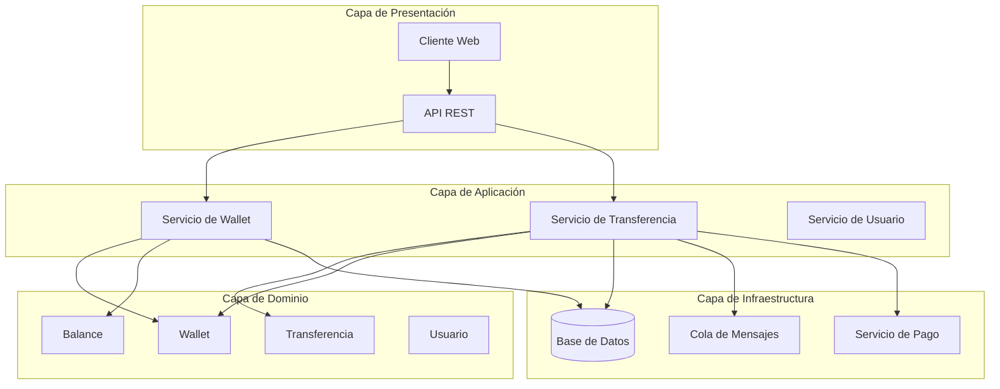

# Implementación Práctica

Esta sección proporciona guías concretas y ejemplos paso a paso para aplicar los conceptos de DDD en proyectos reales, conectando la teoría con la práctica.

## ¿Qué aprenderás en esta sección?

En esta sección encontrarás:

1. [**Ejemplos Paso a Paso**](examples.md): Implementaciones detalladas de sistemas basados en DDD
2. **Guías de Implementación**: Recomendaciones prácticas para aplicar DDD en diferentes contextos

## ¿Por qué es importante?

La implementación práctica es crucial porque:

- **Cierra la brecha teórico-práctica**: Muestra cómo aplicar conceptos abstractos en código real
- **Ofrece patrones concretos**: Proporciona soluciones probadas para problemas comunes
- **Evita errores comunes**: Anticipa dificultades frecuentes y cómo superarlas
- **Facilita la adopción**: Proporciona un punto de partida tangible para equipos nuevos en DDD

## Relación con otros conceptos

La implementación práctica se nutre de todas las secciones anteriores:

- Aplica las ideas del [**Modelado del Dominio**](../modelado-del-dominio/index.md) en ejemplos concretos
- Muestra cómo implementar [**Persistencia y Servicios**](../persistencia-y-servicios/index.md) en diferentes tecnologías
- Explora soluciones reales para las [**Capas de Aplicación**](../capas-de-aplicacion/index.md)
- Demuestra métodos para la [**Organización y Escalado**](../organizacion-y-escalado/index.md) en proyectos existentes

## Ejemplo Completo: Sistema de Wallets

En esta sección desarrollamos un sistema completo de wallets financieras que:

1. **Permite gestionar múltiples wallets** por usuario y organización
2. **Soporta diferentes monedas** con conversión entre ellas
3. **Implementa reglas de negocio complejas** como límites de transferencia y aprobaciones
4. **Demuestra integración con servicios externos** como sistemas de pago y notificaciones

## Implementaciones por Tecnología

Ofrecemos implementaciones específicas para:

- **Python con FastAPI**: Ideal para microservicios y APIs
- **TypeScript con Node.js**: Para entornos JavaScript/TypeScript
- **Implementaciones híbridas**: Para sistemas que combinan múltiples tecnologías

## De la teoría a la práctica

Para cada concepto de DDD, mostramos:

1. **Definición conceptual**: Qué es y por qué importa
2. **Patrones de implementación**: Diferentes formas de implementarlo
3. **Código de ejemplo**: Implementaciones concretas en Python y TypeScript
4. **Pruebas**: Cómo probar eficazmente la implementación
5. **Problemas comunes**: Desafíos habituales y sus soluciones

## Empezando tu proyecto DDD

Si estás iniciando un nuevo proyecto con DDD, recomendamos:

1. Comenzar con el [**Modelado del Dominio**](../modelado-del-dominio/index.md)
2. Explorar los ejemplos paso a paso de esta sección
3. Adaptar los patrones a tu contexto específico
4. Seguir un enfoque incremental en la adopción 