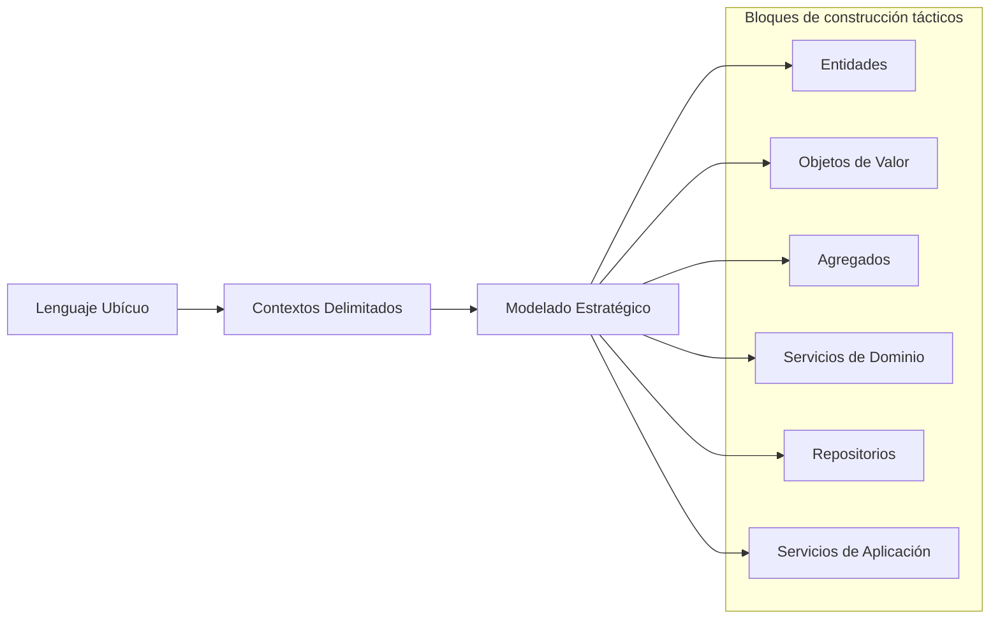

# Diseño Dirigido por el Dominio (DDD)

El Diseño Dirigido por el Dominio (Domain-Driven Design o DDD) es un enfoque para el desarrollo de software que coloca el foco principal en el dominio central de la aplicación. Introducido por Eric Evans en su libro ["Domain-Driven Design: Tackling Complexity in the Heart of Software"](https://fabiofumarola.github.io/nosql/readingMaterial/Evans03.pdf), DDD proporciona tanto una filosofía como un conjunto de patrones para crear software que refleje con precisión el dominio de negocio al que sirve.

## Conceptos Fundamentales

DDD cambia el enfoque de las preocupaciones técnicas al dominio de negocio:

- El código se modela para que coincida con el dominio de negocio
- Se utiliza el lenguaje de los expertos del dominio en el código
- El sistema se organiza alrededor de conceptos del dominio, no de capas técnicas
- La lógica compleja del dominio se aísla para mantenerla pura y mantenible

## Visión General de DDD

El siguiente diagrama muestra cómo se relacionan los conceptos clave de DDD:



## ¿Por qué usar Diseño Dirigido por el Dominio?

DDD es particularmente valioso cuando se construye software para dominios complejos donde:

- Las reglas de negocio son numerosas y con matices
- Existe conocimiento especializado del dominio
- El dominio evoluciona con el tiempo
- Múltiples interesados tienen diferentes perspectivas
- Las implementaciones técnicas podrían fácilmente oscurecer la lógica del dominio

## Beneficios Clave

Cuando se implementa eficazmente, DDD proporciona:

- **Mejor comunicación** entre desarrolladores y expertos del dominio
- **Mayor alineación** entre código y necesidades del negocio
- **Límites más claros** entre diferentes partes del sistema
- **Código más mantenible** que refleja conceptos del mundo real
- **Evolución más sencilla** a medida que cambian las reglas de negocio

## Estructura Típica de un Proyecto DDD

Para aplicar eficazmente DDD, es importante organizar adecuadamente el código. A continuación se muestra una estructura de proyecto recomendada, basada en una aplicación Python con FastAPI que implementa DDD con enfoque orientado a características (feature-oriented):

```
app/
│
├── api/                                # API interfaces (capa de presentación)
│   ├── __init__.py                     # Registra y expone todos los routers
│   ├── deps.py                         # Funciones de inyección de dependencias
│   ├── error_handlers.py               # Manejadores de excepciones personalizados
│   └── v1/                             # Endpoints API v1
│       ├── __init__.py                 # Registra routers v1
│       ├── calendar_events/            # Endpoints de eventos de calendario
│       │   ├── __init__.py
│       │   └── endpoints.py            # Endpoints relacionados con eventos
│       └── fundamental_analysis/       # Endpoints de análisis fundamental
│           ├── __init__.py
│           └── endpoints.py            # Endpoints relacionados con análisis
│
├── application/                        # Capa de aplicación (servicios)
│   ├── __init__.py
│   ├── calendar_events/                # Casos de uso de eventos de calendario
│   │   ├── __init__.py
│   │   ├── dtos.py                     # Objetos de transferencia de datos
│   │   └── service.py                  # Servicio de aplicación
│   └── fundamental_analysis/           # Casos de uso de análisis fundamental
│       ├── __init__.py
│       ├── dtos.py                     # Objetos de transferencia de datos
│       └── service.py                  # Servicio de aplicación
│
├── core/                               # Componentes centrales de la aplicación
│   ├── __init__.py
│   ├── app.py                          # Factory de la app y configuración
│   ├── config.py                       # Carga de configuración (desde vars de entorno)
│   ├── dependencies.py                 # Dependencias a nivel de aplicación
│   ├── events.py                       # Manejadores de eventos de inicio/cierre
│   ├── middleware.py                   # CORS, manejadores de errores, etc.
│   └── security.py                     # Autenticación, autorización
│
├── domains/                            # Capa de dominio (lógica de negocio)
│   ├── __init__.py
│   ├── calendar_events/                # Dominio de Eventos de Calendario
│   │   ├── __init__.py
│   │   ├── entities.py                 # Entidades de dominio con comportamiento
│   │   ├── exceptions.py               # Excepciones específicas del dominio
│   │   ├── repositories.py             # Interfaces de repositorios
│   │   └── value_objects.py            # Objetos de valor inmutables
│   ├── fundamental_analysis/           # Dominio de Análisis Fundamental
│   │   ├── __init__.py
│   │   ├── entities.py                 # Entidades de dominio con comportamiento
│   │   ├── exceptions.py               # Excepciones específicas del dominio
│   │   ├── repositories.py             # Interfaces de repositorios
│   │   └── value_objects.py            # Objetos de valor inmutables
│   └── shared/                         # Conceptos de dominio compartidos
│       ├── __init__.py
│       ├── base_entity.py              # Clase base de entidad
│       ├── base_repository.py          # Interfaz base de repositorio
│       └── value_objects.py            # Objetos de valor compartidos
│
├── infrastructure/                     # Capa de infraestructura
│   ├── __init__.py
│   ├── external/                       # Clientes de servicios externos
│   │   ├── __init__.py
│   │   ├── openai/                     # Cliente de OpenAI
│   │   │   ├── __init__.py
│   │   │   └── client.py               # Cliente API de OpenAI
│   │   └── binance/                    # Cliente de Binance
│   │       ├── __init__.py
│   │       └── client.py               # Cliente API de Binance
│   ├── persistence/                    # Implementaciones de persistencia de datos
│   │   ├── __init__.py
│   │   ├── postgres/                   # Implementaciones PostgreSQL
│   │   │   ├── __init__.py
│   │   │   ├── alembic/                # Migraciones de base de datos
│   │   │   │   ├── versions/           # Scripts de migración
│   │   │   │   ├── env.py              # Entorno de Alembic
│   │   │   │   └── alembic.ini         # Configuración de Alembic
│   │   │   ├── models/                 # Modelos SQLAlchemy
│   │   │   │   ├── __init__.py
│   │   │   │   ├── base.py             # Clase base de modelo
│   │   │   │   ├── calendar_events.py  # Modelos de eventos de calendario
│   │   │   │   └── fundamental.py      # Modelos de análisis fundamental
│   │   │   ├── repositories/           # Implementaciones de repositorios
│   │   │   │   ├── __init__.py
│   │   │   │   ├── calendar_events.py  # Repositorio de eventos de calendario
│   │   │   │   └── fundamental.py      # Repositorio de análisis fundamental
│   │   │   ├── session.py              # Gestión de sesiones de BD
│   │   │   └── unit_of_work.py         # Implementación de unidad de trabajo
│   │   └── redis/                      # Implementaciones Redis
│   │       ├── __init__.py
│   │       ├── client.py               # Configuración del cliente Redis
│   │       ├── models/                 # Modelos de datos Redis
│   │       │   ├── __init__.py
│   │       │   ├── calendar_events.py  # Modelos de datos de eventos
│   │       │   └── fundamental.py      # Modelos de datos de análisis
│   │       └── repositories/           # Implementaciones de repositorios
│   │           ├── __init__.py
│   │           ├── calendar_events.py  # Repositorio de eventos de calendario
│   │           └── fundamental.py      # Repositorio de análisis fundamental
│   └── messaging/                      # Infraestructura de mensajería
│       ├── __init__.py
│       └── redis_pubsub.py             # Redis pub/sub para eventos
│
├── utils/                              # Utilidades
│   ├── __init__.py
│   ├── common.py                       # Funciones de utilidad comunes
│   ├── constants.py                    # Constantes de la aplicación
│   └── logger.py                       # Configuración de logging
│
├── __init__.py                         # Hace que el directorio sea un paquete
└── main.py                             # Punto de entrada de la aplicación
```

Esta estructura de proyecto sigue un enfoque orientado a características (feature-first), donde cada dominio de negocio se organiza verticalmente a través de todas las capas. Este enfoque es particularmente útil para aplicaciones complejas o microservicios, ya que facilita:

1. **Navegación más intuitiva** - Los desarrolladores pueden encontrar fácilmente todos los componentes relacionados con una característica
2. **Aislamiento de cambios** - Las modificaciones en una característica tienden a estar contenidas dentro de sus directorios
3. **Desacoplamiento entre características** - Las características dependen mínimamente unas de otras
4. **Escalabilidad del equipo** - Diferentes equipos pueden trabajar en diferentes características con menos conflictos

Al mismo tiempo, mantiene la clara separación de responsabilidades entre las diferentes capas arquitectónicas (presentación, aplicación, dominio e infraestructura).

## Conceptos Clave de DDD

DDD abarca varios conceptos clave que se exploran en detalle:

1. [**Lenguaje Ubicuo**](modelado-del-dominio/ubiquitous-language.md) - Un lenguaje compartido entre desarrolladores y expertos del dominio
2. [**Contextos Delimitados**](organizacion-y-escalado/bounded-contexts.md) - Límites explícitos donde se aplican los modelos
3. [**Entidades y Objetos de Valor**](modelado-del-dominio/entities-value-objects.md) - Los bloques de construcción de los modelos de dominio
4. [**Agregados**](modelado-del-dominio/aggregates.md) - Grupos de entidades relacionadas con límites claros
5. [**Repositorios**](persistencia-y-servicios/repositories.md) - Métodos para recuperar y persistir objetos del dominio, incluyendo el patrón Unit of Work
6. [**Servicios de Dominio**](persistencia-y-servicios/domain-services.md) - Operaciones que no pertenecen naturalmente a las entidades
7. [**Servicios de Aplicación**](capas-de-aplicacion/application-services.md) - Orquestación de objetos de dominio para realizar casos de uso

## DDD y Arquitectura

DDD no especifica una arquitectura específica, pero funciona bien con patrones como:

- **Arquitectura de Capas**: Separar dominio, aplicación e infraestructura
- **Arquitectura Hexagonal**: Aislar el dominio central con puertos y adaptadores
- **Arquitectura Limpia (Clean Architecture)**: Mantener las reglas de negocio independientes de los detalles técnicos
- **CQRS (Command Query Responsibility Segregation)**: Separar operaciones de lectura y escritura
- **Event Sourcing**: Almacenar cambios de estado como secuencia de eventos

## DDD en la Práctica

El siguiente ejemplo en Python ilustra un modelo de dominio simple utilizando conceptos de DDD:

```python
from dataclasses import dataclass
from typing import List, Optional
from decimal import Decimal
from datetime import datetime
import uuid

# Objeto de Valor
@dataclass(frozen=True)
class Address:
    """Objeto de valor de dirección blockchain con validación."""
    valor: str
    
    def __post_init__(self):
        if not self.valor or len(self.valor) < 26:
            raise ValueError(f"Dirección blockchain inválida: {self.valor}")

# Objeto de Valor
@dataclass(frozen=True)
class CryptoAmount:
    """Valor monetario de criptomoneda."""
    cantidad: Decimal
    simbolo: str
    
    def __post_init__(self):
        if self.cantidad < 0:
            raise ValueError(f"La cantidad no puede ser negativa: {self.cantidad}")

# Entidad
class Wallet:
    """Entidad Wallet con identidad única."""
    def __init__(self, wallet_id: uuid.UUID, address: Address, balances: dict[str, CryptoAmount] = None):
        self.id = wallet_id
        self.address = address
        self.balances = balances or {}
    
    def receive_deposit(self, amount: CryptoAmount) -> None:
        """Lógica de dominio para recibir un depósito."""
        if amount.simbolo not in self.balances:
            self.balances[amount.simbolo] = amount
        else:
            current = self.balances[amount.simbolo]
            self.balances[amount.simbolo] = CryptoAmount(
                current.cantidad + amount.cantidad,
                current.simbolo
            )
    
    def withdraw(self, amount: CryptoAmount) -> None:
        """Lógica de dominio para realizar un retiro."""
        if amount.simbolo not in self.balances:
            raise ValueError(f"No hay balance de {amount.simbolo}")
        
        current = self.balances[amount.simbolo]
        if current.cantidad < amount.cantidad:
            raise ValueError(f"Balance insuficiente: {current.cantidad} {current.simbolo}")
        
        self.balances[amount.simbolo] = CryptoAmount(
            current.cantidad - amount.cantidad,
            current.simbolo
        )

# Repositorio (interfaz)
class WalletRepository:
    """Repositorio para acceso a Wallets."""
    def find_by_id(self, wallet_id: uuid.UUID) -> Optional[Wallet]:
        raise NotImplementedError
        
    def save(self, wallet: Wallet) -> None:
        raise NotImplementedError

# Servicio de Aplicación
class WalletService:
    """Servicio de aplicación para operaciones de wallets."""
    def __init__(self, wallet_repository: WalletRepository):
        self.wallet_repository = wallet_repository
    
    def process_withdrawal(self, wallet_id: uuid.UUID, cantidad: Decimal, simbolo: str) -> None:
        """Caso de uso: Procesar un retiro de criptomoneda."""
        wallet = self.wallet_repository.find_by_id(wallet_id)
        if not wallet:
            raise ValueError(f"Wallet {wallet_id} no encontrada")
            
        # Crear objeto de valor
        amount = CryptoAmount(cantidad, simbolo)
        
        # Usar lógica de dominio
        wallet.withdraw(amount)
        
        # Persistir cambios
        self.wallet_repository.save(wallet)
```

En las secciones siguientes, se explora cada concepto de DDD en profundidad, con ejemplos prácticos de cómo aplicarlos en backends de Python y TypeScript. 