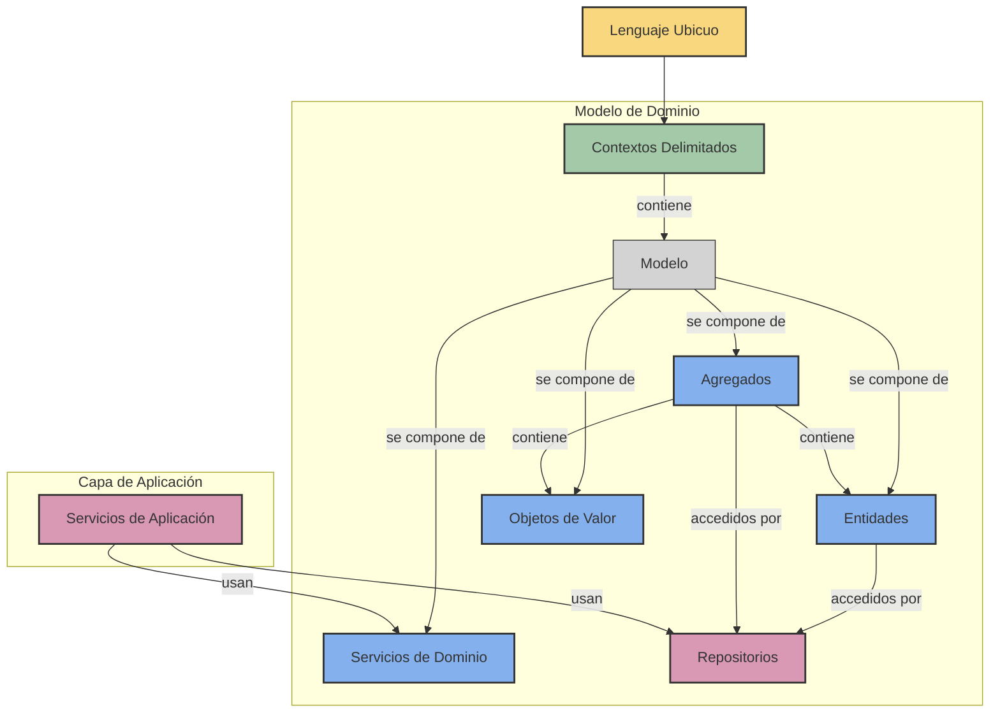

# Diseño Dirigido por el Dominio (DDD)

El Diseño Dirigido por el Dominio (Domain-Driven Design o DDD) es un enfoque para el desarrollo de software que coloca el foco principal en el dominio central de la aplicación. Introducido por Eric Evans en su libro "Domain-Driven Design: Tackling Complexity in the Heart of Software", DDD proporciona tanto una filosofía como un conjunto de patrones para crear software que refleje con precisión el dominio de negocio al que sirve.

## Conceptos Fundamentales

DDD cambia nuestro enfoque de las preocupaciones técnicas al dominio de negocio:

- Modelamos nuestro código para que coincida con el dominio de negocio
- Utilizamos el lenguaje de los expertos del dominio en nuestro código
- Organizamos nuestro sistema alrededor de conceptos del dominio, no de capas técnicas
- Aislamos la lógica compleja del dominio para mantenerla pura y mantenible

## Visión General de DDD

El siguiente diagrama muestra cómo se relacionan los conceptos clave de DDD:



## ¿Por qué usar Diseño Dirigido por el Dominio?

DDD es particularmente valioso cuando se construye software para dominios complejos donde:

- Las reglas de negocio son numerosas y con matices
- Existe conocimiento especializado del dominio
- El dominio evoluciona con el tiempo
- Múltiples interesados tienen diferentes perspectivas
- Las implementaciones técnicas podrían fácilmente oscurecer la lógica del dominio

## Beneficios Clave

Cuando se implementa eficazmente, DDD proporciona:

- **Mejor comunicación** entre desarrolladores y expertos del dominio
- **Mayor alineación** entre código y necesidades del negocio
- **Límites más claros** entre diferentes partes del sistema
- **Código más mantenible** que refleja conceptos del mundo real
- **Evolución más sencilla** a medida que cambian las reglas de negocio

## Estructura Típica de un Proyecto DDD

Para aplicar eficazmente DDD, es importante organizar adecuadamente el código. A continuación se muestra una estructura de proyecto recomendada:

```
ecommerce-domain/
├── src/
│   ├── domain/                     # Núcleo de la lógica de dominio
│   │   ├── model/                  # Entidades, Objetos de Valor, Agregados
│   │   │   ├── cart/               # Agregado "Carrito"
│   │   │   │   ├── Cart.py         # Entidad raíz del agregado
│   │   │   │   ├── CartItem.py     # Entidad dentro del agregado
│   │   │   │   └── CartId.py       # Objeto de valor para identificador
│   │   │   ├── customer/           # Agregado "Cliente"
│   │   │   ├── order/              # Agregado "Pedido"
│   │   │   ├── product/            # Agregado "Producto"
│   │   │   └── shared/             # Objetos de valor compartidos
│   │   │       ├── Address.py
│   │   │       ├── Money.py
│   │   │       └── Email.py
│   │   ├── service/                # Servicios de dominio
│   │   │   ├── CartService.py
│   │   │   └── OrderService.py
│   │   ├── repository/             # Interfaces de repositorios
│   │   │   ├── CartRepository.py
│   │   │   └── OrderRepository.py
│   │   └── event/                  # Eventos de dominio
│   │       ├── CartCreated.py
│   │       └── OrderPlaced.py
│   │
│   ├── application/                # Capa de aplicación
│   │   ├── service/                # Servicios de aplicación
│   │   │   ├── CartApplicationService.py
│   │   │   └── OrderApplicationService.py
│   │   ├── dto/                    # Objetos de transferencia de datos
│   │   └── command/                # Comandos y manejadores
│   │
│   └── infrastructure/             # Implementaciones técnicas
│       ├── persistence/            # Implementaciones de repositorios
│       │   ├── sql/
│       │   │   └── SQLCartRepository.py
│       │   └── mongodb/
│       ├── messaging/              # Implementación de mensajería
│       └── api/                    # Controladores de API
│
└── tests/                          # Pruebas organizadas por capa/componente
    ├── domain/
    ├── application/
    └── infrastructure/
```

## Conceptos Clave de DDD

DDD abarca varios conceptos clave que exploraremos en detalle:

1. [**Lenguaje Ubicuo**](ubiquitous-language.md) - Un lenguaje compartido entre desarrolladores y expertos del dominio
2. [**Contextos Delimitados**](bounded-contexts.md) - Límites explícitos donde se aplican los modelos
3. [**Entidades y Objetos de Valor**](entities-value-objects.md) - Los bloques de construcción de los modelos de dominio
4. [**Agregados**](aggregates.md) - Grupos de entidades relacionadas con límites claros
5. [**Repositorios**](repositories.md) - Métodos para recuperar y persistir objetos del dominio
6. [**Servicios de Dominio**](domain-services.md) - Operaciones que no pertenecen naturalmente a las entidades
7. [**Servicios de Aplicación**](application-services.md) - Orquestación de objetos de dominio para realizar casos de uso

## DDD y Arquitectura

DDD no especifica una arquitectura específica, pero funciona bien con patrones como:

- **Arquitectura de Capas**: Separar dominio, aplicación e infraestructura
- **Arquitectura Hexagonal**: Aislar el dominio central con puertos y adaptadores
- **Arquitectura Limpia (Clean Architecture)**: Mantener las reglas de negocio independientes de los detalles técnicos
- **CQRS (Command Query Responsibility Segregation)**: Separar operaciones de lectura y escritura
- **Event Sourcing**: Almacenar cambios de estado como secuencia de eventos

## DDD en la Práctica

El siguiente ejemplo en Python ilustra un modelo de dominio simple utilizando conceptos de DDD:

```python
from dataclasses import dataclass
from typing import List, Optional

# Objeto de Valor
@dataclass(frozen=True)
class Email:
    """Objeto de valor de Email con validación."""
    direccion: str
    
    def __post_init__(self):
        if "@" not in self.direccion:
            raise ValueError(f"Email inválido: {self.direccion}")

# Entidad
class Usuario:
    """Entidad Usuario con identidad única."""
    def __init__(self, usuario_id: int, nombre: str, email: Email):
        self.id = usuario_id
        self.nombre = nombre
        self.email = email
    
    def cambiar_email(self, nuevo_email: Email) -> None:
        """Lógica de dominio para cambiar email."""
        if nuevo_email.direccion == self.email.direccion:
            raise ValueError("El nuevo email debe ser diferente")
        self.email = nuevo_email

# Repositorio (interfaz)
class RepositorioUsuarios:
    """Repositorio para acceso a Usuarios."""
    def buscar_por_id(self, usuario_id: int) -> Optional[Usuario]:
        raise NotImplementedError
        
    def guardar(self, usuario: Usuario) -> None:
        raise NotImplementedError

# Servicio de Aplicación
class ServicioUsuarios:
    """Servicio de aplicación para operaciones de usuarios."""
    def __init__(self, repositorio_usuarios: RepositorioUsuarios):
        self.repositorio_usuarios = repositorio_usuarios
    
    def cambiar_email_usuario(self, usuario_id: int, nuevo_email_str: str) -> None:
        """Caso de uso: Cambiar la dirección de email de un usuario."""
        usuario = self.repositorio_usuarios.buscar_por_id(usuario_id)
        if not usuario:
            raise ValueError(f"Usuario {usuario_id} no encontrado")
            
        # Crear objeto de valor
        nuevo_email = Email(nuevo_email_str)
        
        # Usar lógica de dominio
        usuario.cambiar_email(nuevo_email)
        
        # Persistir cambios
        self.repositorio_usuarios.guardar(usuario)
```

En las secciones siguientes, exploraremos cada concepto de DDD en profundidad, con ejemplos prácticos de cómo aplicarlos en backends de Python y TypeScript. 