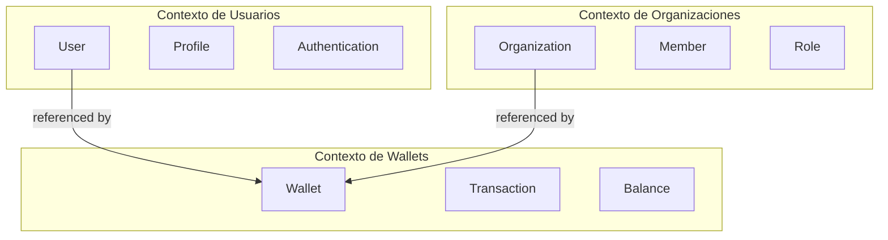

# Organización y Escalado

Esta sección aborda cómo estructurar y escalar sistemas basados en DDD cuando crecen más allá de un único modelo o equipo, estableciendo límites efectivos y organizando el código de manera sostenible.

## ¿Qué aprenderás en esta sección?

En esta sección exploraremos:

1. [**Contextos Delimitados**](bounded-contexts.md): Definición de fronteras explícitas para modelos de dominio
2. [**Estructura de Código**](code-structure.md): Organización física del código para sistemas basados en DDD

## ¿Por qué es importante?

Estos conceptos son fundamentales porque:

- **Manejan la complejidad**: Permiten trabajar con dominios grandes y complejos dividiéndolos
- **Facilitan la colaboración**: Permiten que múltiples equipos trabajen en paralelo
- **Evitan modelos monolíticos**: Previenen la creación de modelos inmanejables
- **Alinean organización y software**: Respetan los límites naturales del negocio

## Relación con otros conceptos

La organización y el escalado se relacionan con:

- El [**Modelado del Dominio**](../modelado-del-dominio/index.md) definiendo los límites de cada modelo
- La [**Persistencia y Servicios**](../persistencia-y-servicios/index.md) a través de patrones de integración entre contextos
- Las [**Capas de Aplicación**](../capas-de-aplicacion/index.md) mediante la delimitación de casos de uso

## Ejemplo Práctico

En nuestro sistema financiero, podríamos tener distintos contextos delimitados:



En cuanto a la estructura del código, podríamos organizarlo así:

```
financial-system/
├── contexts/
│   ├── wallets/
│   │   ├── domain/
│   │   │   ├── entities.py
│   │   │   ├── repositories.py
│   │   │   └── services.py
│   │   ├── application/
│   │   │   ├── dtos.py
│   │   │   └── services.py
│   │   └── infrastructure/
│   │       ├── persistence/
│   │       └── api/
│   ├── users/
│   │   ├── domain/
│   │   ├── application/
│   │   └── infrastructure/
│   └── organizations/
│       ├── domain/
│       ├── application/
│       └── infrastructure/
└── shared/
    ├── domain/
    └── infrastructure/
```

## Aspectos Clave

- **Mapeo de Contexto**: Define cómo los contextos se relacionan entre sí (Cliente-Proveedor, Conformista, Anticorrupción)
- **Integración entre Contextos**: Patrones como publicación de eventos, servicios compartidos o APIs
- **Conway's Law**: "Las organizaciones diseñan sistemas que reflejan su propia estructura de comunicación"
- **Equipos por Contexto**: Idealmente, cada contexto delimitado tiene un equipo dedicado

## Próximos Pasos

Después de comprender cómo organizar y escalar sistemas DDD, te recomendamos explorar la [Implementación Práctica](../implementacion-practica/index.md) para ver ejemplos concretos y guías paso a paso. 