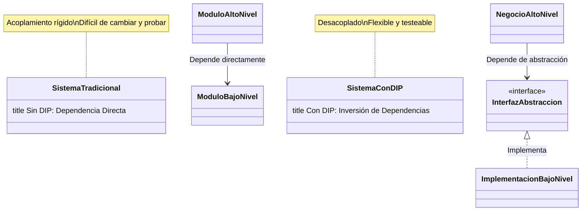

# Principio de Inversión de Dependencias (DIP)

> "Los módulos de alto nivel no deberían depender de módulos de bajo nivel. Ambos deberían depender de abstracciones."
>
> "Las abstracciones no deberían depender de los detalles. Los detalles deberían depender de las abstracciones."
> 
> — Robert C. Martin

## ¿Qué es el DIP?
El Principio de Inversión de Dependencias dice que el código principal de tu aplicación (la lógica de negocio) no debe depender directamente de detalles como bases de datos, servicios externos o librerías. En vez de eso, ambos deben depender de interfaces o abstracciones.

---

## Caso de uso: Notificaciones a usuarios

Supón que tienes que enviar notificaciones a los usuarios cuando se registran. ¿Qué pasa si no aplicas DIP?

### Problema (antes de DIP)

```python
class ServicioNotificacionEmail:
    def enviar(self, destinatario, mensaje):
        print(f"Enviando email a {destinatario}: {mensaje}")

class GestorUsuarios:
    def __init__(self):
        self.notificador = ServicioNotificacionEmail()  # Dependencia directa
    def registrar(self, email, nombre):
        print(f"Usuario {nombre} registrado")
        self.notificador.enviar(email, "¡Bienvenido!")
```

**¿Qué está mal aquí?**
- `GestorUsuarios` depende directamente de una implementación concreta.
- Si quieres cambiar a SMS o push, tienes que modificar la clase.
- Es difícil de probar (no puedes simular el envío de emails fácilmente).

---

## ¿Por qué es un problema?
- **Poco flexible:** Cambiar la forma de notificar requiere modificar el código principal.
- **Difícil de probar:** No puedes usar mocks o stubs fácilmente.
- **Acoplamiento fuerte:** El código de negocio depende de detalles técnicos.

---

## Solución: Aplicando DIP

Creamos una interfaz para la notificación y hacemos que el gestor dependa de esa interfaz, no de la implementación concreta.

```python
from abc import ABC, abstractmethod

class ServicioNotificacion(ABC):
    @abstractmethod
    def enviar(self, destinatario, mensaje):
        pass

class ServicioNotificacionEmail(ServicioNotificacion):
    def enviar(self, destinatario, mensaje):
        print(f"Enviando email a {destinatario}: {mensaje}")

class ServicioNotificacionSMS(ServicioNotificacion):
    def enviar(self, destinatario, mensaje):
        print(f"Enviando SMS a {destinatario}: {mensaje}")

class GestorUsuarios:
    def __init__(self, notificador: ServicioNotificacion):
        self.notificador = notificador  # Depende de la abstracción
    def registrar(self, email, nombre):
        print(f"Usuario {nombre} registrado")
        self.notificador.enviar(email, "¡Bienvenido!")

# Uso:
gestor = GestorUsuarios(ServicioNotificacionEmail())
gestor.registrar("ana@ejemplo.com", "Ana")

gestor_sms = GestorUsuarios(ServicioNotificacionSMS())
gestor_sms.registrar("123456789", "Juan")
```

**¿Qué mejoró?**
- Puedes cambiar la forma de notificar sin tocar el código principal.
- Es fácil de probar usando mocks.
- El código es más flexible y mantenible.

---

## Checklist para aplicar DIP
- [ ] ¿Tu lógica de negocio depende solo de interfaces o abstracciones?
- [ ] ¿Puedes cambiar la implementación sin modificar el código principal?
- [ ] ¿Puedes probar tu código usando mocks o stubs?
- [ ] ¿Evitas crear instancias de servicios concretos dentro de tus clases principales?

---

## Resumen
El DIP te ayuda a crear sistemas desacoplados y fáciles de probar. Si tu código principal depende de detalles técnicos, ¡es momento de introducir abstracciones!

## Visualización



## ¿Por qué es importante?

- Reduce el acoplamiento entre módulos
- Facilita el cambio de implementaciones
- Mejora la testabilidad del código
- Permite el desarrollo en paralelo de componentes
- Promueve un diseño modular y flexible

## Ejemplo problemático

```python
class ServicioNotificacionEmail:
    def enviar_email(self, destinatario, asunto, mensaje):
        print(f"Enviando email a {destinatario}, Asunto: {asunto}, Mensaje: {mensaje}")
        # Lógica para enviar email...

class GestorUsuarios:
    def __init__(self):
        # Dependencia directa de una implementación concreta
        self.notificador = ServicioNotificacionEmail()
    
    def registrar_usuario(self, email, nombre):
        # Lógica para registrar usuario...
        print(f"Usuario {nombre} registrado")
        
        # Dependencia rígida de una implementación específica
        self.notificador.enviar_email(
            email,
            "Bienvenido al sistema",
            f"Hola {nombre}, tu cuenta ha sido creada con éxito."
        )
```

Este diseño es problemático porque:
- `GestorUsuarios` depende directamente de `ServicioNotificacionEmail`
- Es difícil cambiar el mecanismo de notificación (SMS, push, etc.)
- Es difícil hacer pruebas unitarias sin enviar emails reales

## Solución aplicando DIP

```python
from abc import ABC, abstractmethod

# 1. Definir una abstracción
class ServicioNotificacion(ABC):
    @abstractmethod
    def enviar_notificacion(self, destinatario, asunto, mensaje):
        pass

# 2. Implementar la abstracción
class ServicioNotificacionEmail(ServicioNotificacion):
    def enviar_notificacion(self, destinatario, asunto, mensaje):
        print(f"Enviando email a {destinatario}, Asunto: {asunto}, Mensaje: {mensaje}")
        # Lógica para enviar email...

class ServicioNotificacionSMS(ServicioNotificacion):
    def enviar_notificacion(self, destinatario, asunto, mensaje):
        print(f"Enviando SMS a {destinatario}: {mensaje}")
        # Lógica para enviar SMS...

# 3. Alto nivel depende de abstracción mediante inyección de dependencias
class GestorUsuarios:
    def __init__(self, servicio_notificacion: ServicioNotificacion):
        # Dependencia de una abstracción, no de una implementación concreta
        self.notificador = servicio_notificacion
    
    def registrar_usuario(self, destinatario, nombre):
        # Lógica para registrar usuario...
        print(f"Usuario {nombre} registrado")
        
        # Usa la abstracción
        self.notificador.enviar_notificacion(
            destinatario,
            "Bienvenido al sistema",
            f"Hola {nombre}, tu cuenta ha sido creada con éxito."
        )

# 4. Configuración de la aplicación / contenedor DI
notificador_email = ServicioNotificacionEmail()
gestor = GestorUsuarios(notificador_email)
gestor.registrar_usuario("usuario@ejemplo.com", "Ana")

# Cambiar a SMS es sencillo
notificador_sms = ServicioNotificacionSMS()
gestor_con_sms = GestorUsuarios(notificador_sms)
gestor_con_sms.registrar_usuario("123456789", "Juan")
```

## Técnicas para implementar DIP

1. **Inyección de dependencias**: Pasar las dependencias desde el exterior
   - Inyección por constructor (preferida)
   - Inyección por método
   - Inyección por propiedad

2. **Contenedores de IoC** (Inversión de Control): Automatizar la inyección de dependencias

3. **Uso de interfaces/clases abstractas**: Definir contratos claros entre componentes

4. **Factories y Service Locators**: Aislar la creación de objetos concretos

## Beneficios de aplicar DIP

- **Desacoplamiento**: Componentes menos dependientes entre sí
- **Facilidad de cambio**: Implementaciones intercambiables
- **Testabilidad**: Fácil sustitución por mocks o stubs
- **Reutilización**: Componentes más genéricos y flexibles
- **Mantenibilidad**: Código más robusto ante cambios

## Retos comunes

- **Sobregeneralización**: Crear abstracciones innecesarias
- **Indirección excesiva**: Demasiadas capas que dificultan la comprensión
- **Abstracciones filtradas**: Cuando los detalles se filtran a través de las abstracciones

## Relación con otros principios SOLID

- Facilita el **Principio Abierto-Cerrado** al permitir extensiones sin modificación
- Apoya el **Principio de Sustitución de Liskov** mediante el uso adecuado de abstracciones
- Complementa el **Principio de Segregación de Interfaces** para crear dependencias específicas
- Refuerza el **Principio de Responsabilidad Única** al separar la creación de la lógica 