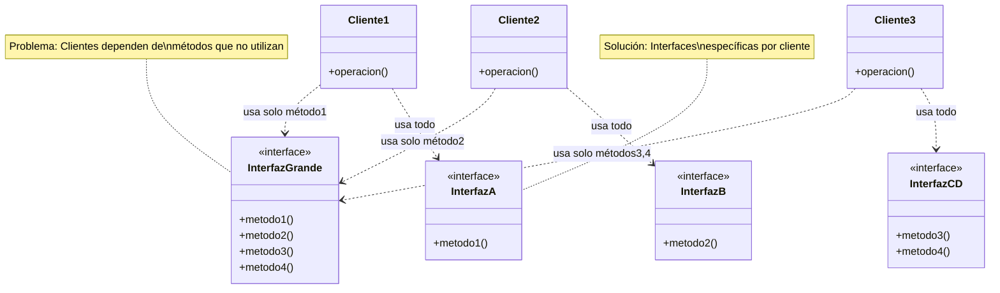

# Principio de Segregación de Interfaces (ISP)

> "Los clientes no deberían verse forzados a depender de interfaces que no utilizan."
> 
> — Robert C. Martin

## ¿Qué es el ISP?
El Principio de Segregación de Interfaces dice que es mejor tener varias interfaces pequeñas y específicas, en vez de una sola interfaz grande. Así, las clases solo implementan lo que realmente necesitan.

---

## Caso de uso: Servicios de notificación (email, SMS, push, webhooks, cripto-alertas)

Supón que tienes una plataforma SaaS que envía notificaciones por email, SMS, push, webhooks y alertas cripto. ¿Qué pasa si no aplicas ISP?

### Problema (antes de ISP)

```python
from abc import ABC, abstractmethod

class Notificador(ABC):
    @abstractmethod
    def enviar_email(self, destinatario, mensaje):
        pass
    @abstractmethod
    def enviar_sms(self, destinatario, mensaje):
        pass
    @abstractmethod
    def enviar_push(self, destinatario, mensaje):
        pass
    @abstractmethod
    def enviar_webhook(self, url, payload):
        pass
    @abstractmethod
    def enviar_cripto(self, wallet, mensaje):
        pass

class NotificadorEmail(Notificador):
    def enviar_email(self, destinatario, mensaje):
        print(f"Enviando email a {destinatario}: {mensaje}")
    def enviar_sms(self, destinatario, mensaje):
        raise NotImplementedError()
    def enviar_push(self, destinatario, mensaje):
        raise NotImplementedError()
    def enviar_webhook(self, url, payload):
        raise NotImplementedError()
    def enviar_cripto(self, wallet, mensaje):
        raise NotImplementedError()
```

**¿Qué está mal aquí?**
- `NotificadorEmail` tiene que implementar métodos que no usa.
- Si agregas más canales, todas las clases deben actualizarlas aunque no las necesiten.
- Lanza errores en tiempo de ejecución si alguien llama a un método no soportado.

---

## ¿Por qué es un problema?
- **Código innecesario:** Las clases tienen métodos que nunca usan.
- **Errores inesperados:** Puedes llamar a un método que no está implementado.
- **Difícil de mantener:** Cada vez que cambias la interfaz, todas las clases deben cambiar.

---

## Solución: Aplicando ISP

Dividimos la interfaz grande en varias interfaces pequeñas y específicas.

```python
from abc import ABC, abstractmethod

class NotificadorEmail(ABC):
    @abstractmethod
    def enviar_email(self, destinatario, mensaje):
        pass

class NotificadorSMS(ABC):
    @abstractmethod
    def enviar_sms(self, destinatario, mensaje):
        pass

class NotificadorPush(ABC):
    @abstractmethod
    def enviar_push(self, destinatario, mensaje):
        pass

class NotificadorWebhook(ABC):
    @abstractmethod
    def enviar_webhook(self, url, payload):
        pass

class NotificadorCripto(ABC):
    @abstractmethod
    def enviar_cripto(self, wallet, mensaje):
        pass

class ServicioAlertaCripto(NotificadorCripto, NotificadorEmail):
    def enviar_cripto(self, wallet, mensaje):
        print(f"Enviando alerta cripto a {wallet}: {mensaje}")
    def enviar_email(self, destinatario, mensaje):
        print(f"Enviando email a {destinatario}: {mensaje}")

class ServicioNotificacionEmail(NotificadorEmail):
    def enviar_email(self, destinatario, mensaje):
        print(f"Enviando email a {destinatario}: {mensaje}")
```

**¿Qué mejoró?**
- Cada clase implementa solo lo que necesita.
- Si agregas un nuevo canal, solo las clases relevantes lo implementan.
- Menos errores y código más limpio.

---

## Checklist para aplicar ISP
- [ ] ¿Tus interfaces son pequeñas y específicas?
- [ ] ¿Las clases solo implementan los métodos que realmente usan?
- [ ] ¿Evitas métodos que lanzan `NotImplementedError`?
- [ ] ¿Puedes cambiar una interfaz sin afectar a muchas clases?

---

## Resumen
El ISP te ayuda a crear sistemas flexibles y fáciles de mantener. Si una clase tiene que implementar métodos que no usa, ¡es momento de dividir la interfaz!

## ¿Qué es?

El Principio de Segregación de Interfaces establece que es mejor tener muchas interfaces específicas en lugar de una interfaz general. Las clases solo deberían conocer los métodos que realmente necesitan usar.

## Visualización



## ¿Por qué es importante?

- Reduce el acoplamiento entre componentes
- Minimiza el impacto de los cambios
- Mejora la cohesión de las interfaces
- Evita dependencias innecesarias
- Facilita el mantenimiento y la refactorización

## Ejemplo problemático

```python
from abc import ABC, abstractmethod

class DispositivoMultifuncion(ABC):
    @abstractmethod
    def imprimir(self, documento):
        pass
    
    @abstractmethod
    def escanear(self, documento):
        pass
    
    @abstractmethod
    def enviar_fax(self, documento):
        pass
    
    @abstractmethod
    def fotocopiar(self, documento):
        pass

# Esta clase necesita implementar métodos que no usa
class ImpresoraSimple(DispositivoMultifuncion):
    def imprimir(self, documento):
        print(f"Imprimiendo: {documento}")
    
    def escanear(self, documento):
        # No soportado
        raise NotImplementedError("La impresora simple no puede escanear")
    
    def enviar_fax(self, documento):
        # No soportado
        raise NotImplementedError("La impresora simple no puede enviar fax")
    
    def fotocopiar(self, documento):
        # No soportado
        raise NotImplementedError("La impresora simple no puede fotocopiar")
```

## Solución aplicando ISP

```python
from abc import ABC, abstractmethod

class Impresora(ABC):
    @abstractmethod
    def imprimir(self, documento):
        pass

class Escaner(ABC):
    @abstractmethod
    def escanear(self, documento):
        pass

class DispositivoFax(ABC):
    @abstractmethod
    def enviar_fax(self, documento):
        pass

class Fotocopiadora(ABC):
    @abstractmethod
    def fotocopiar(self, documento):
        pass

# Ahora las clases solo implementan lo que necesitan
class ImpresoraSimple(Impresora):
    def imprimir(self, documento):
        print(f"Imprimiendo: {documento}")

# Un dispositivo multifunción puede implementar múltiples interfaces
class DispositivoAvanzado(Impresora, Escaner, DispositivoFax, Fotocopiadora):
    def imprimir(self, documento):
        print(f"Dispositivo avanzado imprimiendo: {documento}")
    
    def escanear(self, documento):
        print(f"Dispositivo avanzado escaneando: {documento}")
    
    def enviar_fax(self, documento):
        print(f"Dispositivo avanzado enviando fax: {documento}")
    
    def fotocopiar(self, documento):
        print(f"Dispositivo avanzado fotocopiando: {documento}")
```

## Beneficios de la segregación de interfaces

1. **Mayor flexibilidad**: Las clases solo implementan lo que necesitan
2. **Menor acoplamiento**: Las clases cliente solo dependen de los métodos que usan
3. **Facilidad de refactorización**: Los cambios en una interfaz afectan a menos clases
4. **Mejor testabilidad**: Es más fácil crear mocks de interfaces pequeñas y enfocadas

## Cómo aplicar ISP en la práctica

1. Diseñar interfaces basadas en las necesidades del cliente, no del implementador
2. Observar el uso real de las interfaces para identificar cohesión
3. Descomponer interfaces grandes en interfaces más pequeñas y específicas
4. Aplicar el "Principio de Responsabilidad Única" a nivel de interfaces

## Indicadores de violación del ISP

- Implementaciones de métodos que lanzan excepciones como `NotImplementedError`
- Métodos con implementaciones vacías
- Clientes que solo usan una pequeña parte de una interfaz grande
- Frecuentes cambios en interfaces que afectan a muchos clientes

## Relación con otros principios SOLID

- Complementa el **Principio de Responsabilidad Única** al centrarse en la cohesión a nivel de interfaces
- Facilita el **Principio de Sustitución de Liskov** al crear interfaces más específicas
- Apoya el **Principio de Inversión de Dependencias** permitiendo dependencias más precisas
- Ayuda a cumplir el **Principio Abierto-Cerrado** con extensiones más enfocadas

## ISP en diferentes lenguajes de programación

- En lenguajes con interfaces explícitas como Java, C#, TypeScript
- En Python usando clases abstractas y herencia múltiple
- En lenguajes dinámicos a través del duck typing
- En lenguajes funcionales mediante firmas de función y tipos de datos 