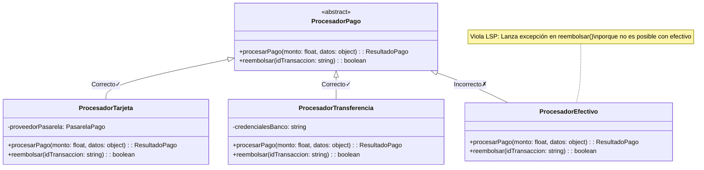

# Principio de Sustitución de Liskov (LSP)

> "Si S es un subtipo de T, entonces los objetos de tipo T pueden ser reemplazados por objetos de tipo S sin alterar ninguna de las propiedades deseables del programa."
> 
> — Barbara Liskov

## ¿Qué es?

El Principio de Sustitución de Liskov establece que las clases derivadas deben poder sustituir a sus clases base sin afectar el comportamiento esperado del programa. En otras palabras, las subclases deben comportarse de manera que no sorprendan a quienes usan la clase base.

## Visualización



## ¿Por qué es importante?

- Garantiza que la herencia se utilice correctamente
- Evita comportamientos inesperados al usar polimorfismo
- Facilita la extensión de código sin introducir errores
- Promueve un diseño más coherente y predecible

## Ejemplo de implementación

```python
from abc import ABC, abstractmethod
from datetime import datetime
from typing import Dict, Any, Optional

class ResultadoPago:
    def __init__(self, exitoso: bool, id_transaccion: Optional[str] = None, error: Optional[str] = None):
        self.exitoso = exitoso
        self.id_transaccion = id_transaccion
        self.error = error
        self.timestamp = datetime.now()

class ProcesadorPago(ABC):
    @abstractmethod
    def procesar_pago(self, monto: float, datos: Dict[str, Any]) -> ResultadoPago:
        """Procesa un pago con el monto y datos proporcionados"""
        pass
    
    @abstractmethod
    def reembolsar(self, id_transaccion: str) -> bool:
        """Reembolsa una transacción previa basada en su ID"""
        pass

# Implementación correcta de LSP
class ProcesadorTarjeta(ProcesadorPago):
    def __init__(self, api_key: str):
        self.api_key = api_key
        self.transacciones = {}
    
    def procesar_pago(self, monto: float, datos: Dict[str, Any]) -> ResultadoPago:
        # Validar datos de tarjeta
        if 'numero_tarjeta' not in datos or 'cvv' not in datos or 'fecha_exp' not in datos:
            return ResultadoPago(False, error="Datos de tarjeta incompletos")
        
        # Procesamiento real conectaría con una pasarela de pago
        id_transaccion = f"txn-{datetime.now().timestamp()}"
        self.transacciones[id_transaccion] = monto
        
        return ResultadoPago(True, id_transaccion=id_transaccion)
    
    def reembolsar(self, id_transaccion: str) -> bool:
        if id_transaccion not in self.transacciones:
            return False
        
        # Lógica real de reembolso con la pasarela
        del self.transacciones[id_transaccion]
        return True

# Implementación correcta de LSP
class ProcesadorTransferencia(ProcesadorPago):
    def __init__(self, credenciales_banco: str):
        self.credenciales_banco = credenciales_banco
        self.transacciones = {}
    
    def procesar_pago(self, monto: float, datos: Dict[str, Any]) -> ResultadoPago:
        # Validar datos de transferencia
        if 'cuenta_origen' not in datos or 'cuenta_destino' not in datos:
            return ResultadoPago(False, error="Datos de cuentas incompletos")
        
        id_transaccion = f"bank-{datetime.now().timestamp()}"
        self.transacciones[id_transaccion] = monto
        
        return ResultadoPago(True, id_transaccion=id_transaccion)
    
    def reembolsar(self, id_transaccion: str) -> bool:
        if id_transaccion not in self.transacciones:
            return False
        
        # Lógica real de reembolso con APIs bancarias
        del self.transacciones[id_transaccion]
        return True

# Violación de LSP: Lanza excepción en método reembolsar
class ProcesadorEfectivo(ProcesadorPago):
    def procesar_pago(self, monto: float, datos: Dict[str, Any]) -> ResultadoPago:
        # Simulación de registro de pago en efectivo
        if 'confirmado_por' not in datos:
            return ResultadoPago(False, error="Falta confirmación del cajero")
            
        id_transaccion = f"cash-{datetime.now().timestamp()}"
        return ResultadoPago(True, id_transaccion=id_transaccion)
    
    def reembolsar(self, id_transaccion: str) -> bool:
        # ¡Viola LSP! Un cliente esperaría poder reembolsar cualquier tipo de pago
        raise NotImplementedError("Los pagos en efectivo no pueden ser reembolsados automáticamente")
```

```python
# Cliente que usa los procesadores de pago
def realizar_compra_con_garantia(procesador: ProcesadorPago, monto: float, datos: Dict[str, Any]) -> bool:
    """
    Realiza una compra con garantía de reembolso si es necesario
    """
    resultado = procesador.procesar_pago(monto, datos)
    
    if not resultado.exitoso:
        print(f"Error en el pago: {resultado.error}")
        return False
    
    # Si algo sale mal en la entrega del producto
    hay_problema_entrega = verificar_problemas_entrega()
    
    if hay_problema_entrega:
        # Esto funcionará con tarjeta y transferencia, pero fallará con efectivo
        # violando el principio de sustitución de Liskov
        reembolso_exitoso = procesador.reembolsar(resultado.id_transaccion)
        return reembolso_exitoso
    
    return True

def verificar_problemas_entrega() -> bool:
    # Simulación de verificación
    return False
```

## Ejemplo problemático clásico

```python
class Rectangulo:
    def __init__(self, ancho, alto):
        self.ancho = ancho
        self.alto = alto
        
    def establecer_ancho(self, ancho):
        self.ancho = ancho
        
    def establecer_alto(self, alto):
        self.alto = alto
        
    def calcular_area(self):
        return self.ancho * self.alto

class Cuadrado(Rectangulo):
    def __init__(self, lado):
        super().__init__(lado, lado)
        
    # Aquí está el problema - rompe el comportamiento esperado
    def establecer_ancho(self, ancho):
        self.ancho = ancho
        self.alto = ancho  # Un cuadrado debe tener lados iguales
        
    def establecer_alto(self, alto):
        self.ancho = alto  # Un cuadrado debe tener lados iguales
        self.alto = alto
```

```python
def calcular_y_mostrar_area(rectangulo):
    rectangulo.establecer_ancho(5)
    rectangulo.establecer_alto(4)
    # Este código espera que el área sea 5*4=20
    assert rectangulo.calcular_area() == 20
    return rectangulo.calcular_area()

# Esto funciona
r = Rectangulo(3, 3)
calcular_y_mostrar_area(r)  # Devuelve 20 como se esperada

# Esto falla
c = Cuadrado(3)
calcular_y_mostrar_area(c)  # Devuelve 16 en lugar de 20 - ¡Viola LSP!
```

## Solución aplicando LSP

Una mejor solución para el ejemplo del rectángulo sería evitar la herencia en este caso y usar composición o interfaces diferentes:

```python
from abc import ABC, abstractmethod

class Forma(ABC):
    @abstractmethod
    def calcular_area(self):
        pass

class Rectangulo(Forma):
    def __init__(self, ancho, alto):
        self.ancho = ancho
        self.alto = alto
        
    def establecer_ancho(self, ancho):
        self.ancho = ancho
        
    def establecer_alto(self, alto):
        self.alto = alto
        
    def calcular_area(self):
        return self.ancho * self.alto

class Cuadrado(Forma):
    def __init__(self, lado):
        self.lado = lado
        
    def establecer_lado(self, lado):
        self.lado = lado
        
    def calcular_area(self):
        return self.lado * self.lado
```

## Reglas para cumplir con LSP

Para asegurar que tus subtipos cumplen con el Principio de Sustitución de Liskov:

1. **Precondiciones**: No pueden ser más estrictas en la subclase
2. **Postcondiciones**: No pueden ser más débiles en la subclase
3. **Invariantes**: Deben mantenerse en las subclases
4. **Restricciones históricas**: La historia de estados permitidos no debe cambiar
5. **No introducir excepciones nuevas** que no estén en la clase base

## Señales de violación del LSP

- Sobrescrituras de métodos que lanzan excepciones inesperadas
- Métodos sobrescritos que no hacen nada o tienen comportamientos radicalmente diferentes
- Comprobaciones `instanceof` o `type()` frecuentes
- Comentarios como "No llamar a este método en X situación"

## Beneficios de aplicar LSP

- Mayor reusabilidad de código
- Mejor diseño de herencia
- Facilita la implementación del Principio Abierto-Cerrado
- Menor acoplamiento entre componentes
- Código más fácil de probar

## Relación con otros principios SOLID

- Complementa el **Principio Abierto-Cerrado** al garantizar que las extensiones funcionan correctamente
- Apoya la **Inversión de Dependencias** al permitir trabajar con abstracciones de manera segura
- Se relaciona con el **Principio de Segregación de Interfaces** para crear contratos bien definidos 