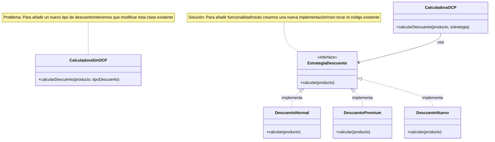

# Principio de Abierto-Cerrado (OCP)

> "Las entidades de software (clases, módulos, funciones, etc.) deben estar abiertas para la extensión, pero cerradas para la modificación."
> 
> — Bertrand Meyer

## ¿Qué es?

El Principio de Abierto-Cerrado establece que deberíamos diseñar nuestras clases, módulos y funciones de manera que se puedan extender (añadir nueva funcionalidad) sin necesidad de modificar el código existente.

## Visualización



## ¿Por qué es importante?

- **Reducción de riesgos**: Al no modificar código existente, se reduce el riesgo de introducir nuevos errores
- **Mantenibilidad**: El código se vuelve más fácil de mantener cuando las nuevas funcionalidades no requieren cambios en lo que ya funciona
- **Escalabilidad**: Facilita la evolución del sistema a medida que cambian los requisitos

## Ejemplo problemático

```python
class CalculadoraDescuento:
    def calcular_descuento(self, producto, tipo_descuento):
        if tipo_descuento == "normal":
            return producto.precio * 0.1
        elif tipo_descuento == "premium":
            return producto.precio * 0.2
        elif tipo_descuento == "especial":
            return producto.precio * 0.3
        # Si añadimos un nuevo tipo de descuento, tendríamos que modificar esta clase
```

## Solución aplicando OCP

```python
from abc import ABC, abstractmethod

class EstrategiaDescuento(ABC):
    @abstractmethod
    def calcular(self, producto):
        pass

class DescuentoNormal(EstrategiaDescuento):
    def calcular(self, producto):
        return producto.precio * 0.1

class DescuentoPremium(EstrategiaDescuento):
    def calcular(self, producto):
        return producto.precio * 0.2

class DescuentoEspecial(EstrategiaDescuento):
    def calcular(self, producto):
        return producto.precio * 0.3

class CalculadoraDescuento:
    def calcular_descuento(self, producto, estrategia_descuento):
        return estrategia_descuento.calcular(producto)

# Para añadir un nuevo tipo de descuento, simplemente creamos una nueva clase:
class DescuentoVIP(EstrategiaDescuento):
    def calcular(self, producto):
        return producto.precio * 0.4
```

## Técnicas para aplicar OCP

1. **Abstracción y polimorfismo**: Usar interfaces o clases abstractas para definir contratos
2. **Patrones de diseño**: Implementar patrones como Strategy, Template Method o Decorator
3. **Composición**: Preferir la composición sobre la herencia para lograr mayor flexibilidad
4. **Inyección de dependencias**: Pasar las dependencias a una clase en lugar de crearlas internamente

## Beneficios

- Facilidad para añadir nuevas funcionalidades sin arriesgar el código existente
- Mejor organización del código
- Mayor cohesión y menor acoplamiento
- Código más testeable

## Equilibrio en la aplicación

Aplicar OCP no significa crear abstracciones excesivas desde el principio:

1. No intentes anticipar todos los posibles cambios futuros
2. Aplica el principio cuando identifiques áreas que cambian frecuentemente
3. Sigue el enfoque "primero lo simple, luego lo flexible"

## Relación con otros principios SOLID

- Se complementa con el **Principio de Inversión de Dependencias** (depender de abstracciones)
- El **Principio de Sustitución de Liskov** garantiza que las extensiones se comporten adecuadamente
- El **Principio de Segregación de Interfaces** ayuda a crear interfaces más específicas y fáciles de extender 